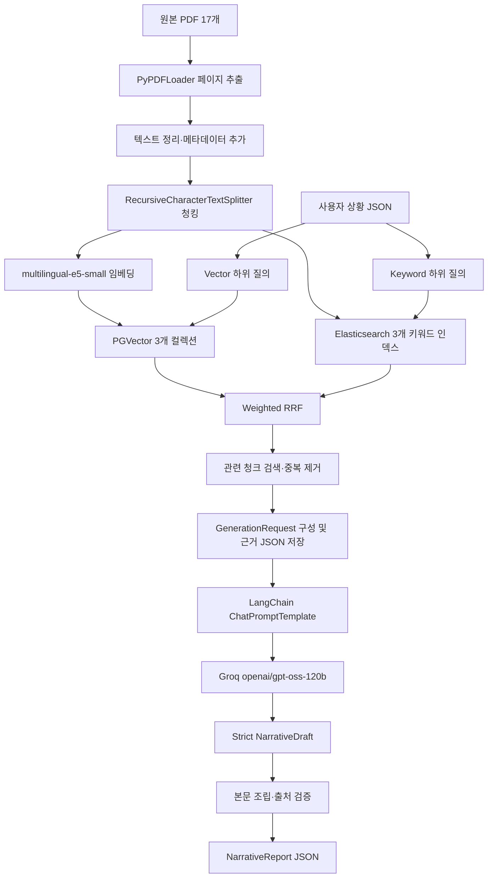

# 현재 구현 상세 설명서

## 1. 문서 목적

이 문서는 청년 자취 독립 플래너 RAG 프로젝트에 현재 구현된 기능을 코드 기준으로 설명한다. 원본 PDF가 어떻게 청크와 벡터·키워드 인덱스로 변환되는지, 사용자가 어떤 값을 입력하는지, PGVector와 Elasticsearch 결과가 어떻게 결합되어 Groq LLM에 전달되는지, 최종적으로 어떤 JSON이 생성되는지를 하나의 흐름으로 연결한다.

현재 시스템의 핵심 결과물은 사용자의 독립 상황을 입력받아 실제 PDF 검색 근거가 포함된 상세한 자취 준비 보고서를 JSON으로 생성하는 것이다. JSON 안에는 보고서 제목과 Markdown 형식의 서술형 본문이 들어간다.

## 2. 현재 구현 범위

현재 구현된 기능은 다음과 같다.

- `guides`, `cases`, `policies` PDF의 텍스트 로딩과 품질 전처리
- 문서 유형별 크기를 적용한 청킹
- 다국어 E5 임베딩 생성
- PostgreSQL과 PGVector의 코퍼스별 컬렉션 적재
- 일반 질의에 대한 컬렉션별 벡터 유사도 검색
- 동일 PDF 청크의 Elasticsearch 적재와 BM25 키워드 검색
- 평가 질문 세트를 이용한 검색 품질 자동 평가
- 사용자 상황을 코퍼스별 검색 질의로 변환
- PGVector와 Elasticsearch 결과의 Weighted RRF 결합
- 실제 Hybrid 검색 근거 선별 및 JSON 저장
- LangChain과 Groq를 이용한 상세 서술형 보고서 생성
- LLM 출력 구조, 본문 길이, 문단 구성과 출처에 대한 후처리 검증

실제 보고서 생성 경로는 임베딩 기반 Vector 검색과 Elasticsearch BM25 키워드 검색을 Weighted RRF로 결합한다. 별도의 reranker, Corrective RAG, 정책 자동 최신화, 웹 UI, 차트 생성, HTML·PDF 렌더링은 아직 구현되지 않았다.

## 3. 전체 시스템 구조



전체 흐름은 서로 다른 두 시점으로 나뉜다.

1. 사전 작업인 적재 단계에서는 같은 PDF 청크를 PGVector와 Elasticsearch에 각각 저장한다.
2. 서비스 실행 단계에서는 사용자 입력으로 두 저장소를 검색하고 순위를 결합한 뒤, 최종 근거와 사용자 상황을 LLM에 전달해 보고서를 생성한다.

## 4. 주요 디렉터리와 파일 역할

```text
src/
├─ config.py
├─ run_rag.py
├─ common/
│  ├─ embedding_factory.py
│  └─ vector_store.py
├─ ingestion/
│  ├─ ingest.py
│  └─ pdf_pipeline.py
├─ retrieval/
│  ├─ search.py
│  ├─ evaluate_retrieval.py
│  └─ rag_pipeline.py
└─ generation/
   ├─ generate_report.py
   ├─ report_generator.py
   └─ report_schema.py
```

| 파일 | 역할 |
|---|---|
| `src/config.py` | 환경변수, PDF 경로, 컬렉션 이름, 청킹 크기, Groq 설정 관리 |
| `src/common/embedding_factory.py` | E5 임베딩 모델 로딩과 문서·질의 임베딩 옵션 설정 |
| `src/common/vector_store.py` | DB 연결 검사, 컬렉션 재구축, 기존 컬렉션 열기, 행 수 확인 |
| `src/common/elasticsearch_store.py` | Elasticsearch 연결, BM25 인덱스 적재와 키워드 검색 |
| `src/ingestion/pdf_pipeline.py` | PDF 탐색, 페이지 추출, NUL 제거, 메타데이터와 청크 ID 생성 |
| `src/ingestion/ingest.py` | 하나 또는 전체 코퍼스를 적재하는 CLI |
| `src/ingestion/elasticsearch.py` | 동일한 PDF 청크를 코퍼스별 Elasticsearch 인덱스에 적재하는 CLI |
| `src/retrieval/search.py` | 사용자가 직접 입력한 검색어로 벡터 검색을 시험하는 CLI |
| `src/retrieval/keyword_search.py` | Elasticsearch BM25 키워드 검색을 시험하는 CLI |
| `src/retrieval/evaluate_keyword_retrieval.py` | 키워드 검색을 별도 결과 경로에 자동 평가하는 CLI |
| `src/retrieval/evaluate_retrieval.py` | 평가 질문 전체를 실행하고 CSV·JSON 평가 결과 생성 |
| `src/retrieval/rag_pipeline.py` | 사용자 상황을 검색 질의로 만들고 실제 보고서 근거를 선별 |
| `src/generation/report_schema.py` | 사용자 입력, 검색 근거, LLM 내부 출력과 최종 출력 스키마 정의 |
| `src/generation/report_generator.py` | LangChain 프롬프트, Groq 호출, 보고서 조립과 출처 검증 |
| `src/generation/generate_report.py` | 검색 근거를 이미 포함한 입력으로 생성 단계만 시험하는 CLI |
| `src/run_rag.py` | 사용자 입력부터 검색·근거 저장·보고서 생성까지 연결하는 실제 RAG CLI |

## 5. PDF 지식베이스 구성

활성 적재 대상은 `knowledge_base/pdfs/` 아래의 PDF다.

| 코퍼스 | 역할 | 기본 컬렉션 | 기본 청킹 |
|---|---|---|---:|
| `guides` | 계약, 이사, 예산 등 실행 지식 | `youth_independence_guides` | 800자, 120자 중첩 |
| `cases` | 실제 청년 경험과 생활비·주거 실태 | `youth_independence_cases` | 1,000자, 150자 중첩 |
| `policies` | 공식 지원정책 공고와 시행계획 | `youth_independence_policies` | 900자, 150자 중첩 |

현재 지식베이스에는 사례 6개, 안내서 4개, 정책 7개로 총 17개의 활성 PDF가 있다. `knowledge_base/archive/`는 보관용이며 적재 대상이 아니다.

## 6. 적재 단계의 입력과 출력

### 6.1 입력

적재 단계의 주 입력은 다음 세 폴더에 있는 PDF 파일이다.

```text
knowledge_base/pdfs/guides/*.pdf
knowledge_base/pdfs/cases/*.pdf
knowledge_base/pdfs/policies/*.pdf
```

CLI에서는 적재 대상을 선택한다.

```powershell
.venv\Scripts\python.exe -m src.ingestion.ingest --corpus guides
.venv\Scripts\python.exe -m src.ingestion.ingest --corpus cases
.venv\Scripts\python.exe -m src.ingestion.ingest --corpus policies
.venv\Scripts\python.exe -m src.ingestion.ingest --corpus all
```

`--dry-run`을 붙이면 PDF 로딩과 청킹까지만 실행하며 임베딩과 DB 변경은 하지 않는다.

### 6.2 PDF 로딩과 전처리

`PyPDFLoader`가 `extract_images=False` 설정으로 PDF를 페이지 단위로 읽는다. 텍스트가 없는 페이지는 제외한다. PostgreSQL의 `text`와 `jsonb`에 저장할 수 없는 NUL 문자 `0x00`은 본문과 메타데이터에서 공백으로 치환한다.

각 페이지에는 다음 메타데이터가 추가된다.

| 필드 | 의미 |
|---|---|
| `source` | 프로젝트 루트 기준 PDF 상대 경로 |
| `source_file` | 원본 PDF 파일명 |
| `corpus` | `guides`, `cases`, `policies` 중 하나 |
| `knowledge_role` | 해당 문서의 지식 역할이며 현재는 corpus와 동일 |
| `document_sha256` | 원본 파일 전체의 SHA-256 해시 |
| `page_number` | 사람이 읽는 기준의 1부터 시작하는 페이지 번호 |

### 6.3 청킹

LangChain의 `RecursiveCharacterTextSplitter`를 사용한다. 제목, 빈 줄, 줄바꿈, 문장 끝, 한국어 종결 표현, 공백 순으로 가능한 경계를 찾은 후 코퍼스별 최대 크기에 맞춰 나눈다.

청크 본문은 연속된 공백을 하나로 정규화한다. 청크마다 페이지 안 순번인 `chunk_index`, 문자 수인 `character_count`, 고유 식별자인 `chunk_id`를 추가한다. `chunk_id`는 코퍼스, 문서 해시, 페이지 번호, 청크 순번과 정규화된 본문을 결합한 뒤 SHA-256으로 만든다.

### 6.4 임베딩

현재 임베딩 모델은 `intfloat/multilingual-e5-small`이다.

- 벡터 차원: 384차원
- 기본 실행 장치: CPU
- 기본 배치 크기: 8
- 문서 접두어: `passage: `
- 검색어 접두어: `query: `
- 벡터 정규화: 사용
- 거리 전략: 코사인 거리

기본값은 로컬 캐시만 사용하도록 설정되어 있다. 모델이 로컬에 없으면 `EMBEDDING_LOCAL_FILES_ONLY=false`로 한 번 내려받아야 한다.

### 6.5 PGVector 저장 출력

LangChain의 `PGVector.from_documents`가 청크 본문, 384차원 벡터와 JSONB 메타데이터를 저장한다. LangChain이 사용하는 주요 테이블은 `langchain_pg_collection`과 `langchain_pg_embedding`이다.

선택한 컬렉션에는 `pre_delete_collection=True`가 적용된다. 따라서 해당 코퍼스를 다시 적재하면 그 컬렉션을 삭제하고 새로 구축한다. 다른 두 코퍼스 컬렉션은 변경하지 않는다.

적재가 끝나면 생성한 청크 수와 DB에 저장된 행 수를 비교한다. 두 값이 다르면 성공으로 처리하지 않고 오류를 발생시킨다.

## 7. 서비스용 사용자 입력

실제 RAG 실행에서 사용자는 검색 근거를 직접 입력하지 않는다. 사용자가 제공하는 값은 `RagRequest`의 `situation` 객체뿐이다. 예제는 `examples/inputs/real_rag_input.json`에 있다.

```json
{
  "situation": {
    "purpose": "취업",
    "age": 27,
    "employment_status": "재직 중",
    "education_status": "대학교 졸업",
    "is_homeowner": false,
    "current_region": "경기도 수원시",
    "target_region": "서울특별시",
    "monthly_income_krw": 2200000,
    "available_cash_krw": 10000000,
    "move_timeline": "3개월 이내",
    "housing_preference": "월세",
    "priorities": ["통근시간", "월 고정비", "안전"],
    "additional_context": "첫 자취이며 보증금과 월 생활비 수준을 가장 걱정하고 있다."
  }
}
```

| 입력 필드 | 형식 | 의미 |
|---|---|---|
| `purpose` | 문자열 | 취업, 취업 준비, 학업 등 독립 목적 |
| `age` | 0~120 정수 | 정책 연령 검색에 사용하는 만 나이 |
| `employment_status` | 문자열 | 재직, 구직, 취업 준비 등 고용 상태 |
| `education_status` | 문자열 | 재학, 졸업 등 학업 상태 |
| `is_homeowner` | 불리언 또는 null | 본인 명의 주택 보유 여부 |
| `current_region` | 문자열 | 현재 거주 지역 |
| `target_region` | 문자열 | 독립하려는 지역 |
| `monthly_income_krw` | 0 이상의 정수 | 현재 월 소득 |
| `available_cash_krw` | 0 이상의 정수 | 보증금과 초기비용 등에 사용할 수 있는 현금 |
| `move_timeline` | 문자열 | 희망 독립 시기 |
| `housing_preference` | 문자열 | 월세 등 선호 주거 형태 |
| `priorities` | 문자열 배열 | 통근, 비용, 안전 등 사용자가 중요하게 보는 조건 |
| `additional_context` | 문자열 | 선택형 항목으로 표현하기 어려운 자유 입력 상황 |
| `target_deposit_krw` | 0 이상의 정수 또는 null | 알아본 매물의 목표 보증금 |
| `target_monthly_rent_krw` | 0 이상의 정수 또는 null | 알아본 매물의 목표 월세 |
| `expected_management_fee_krw` | 0 이상의 정수 또는 null | 예상 월 관리비 |
| `other_monthly_fixed_cost_krw` | 0 이상의 정수 또는 null | 주거비 외 기존 월 고정지출 |
| `monthly_debt_payment_krw` | 0 이상의 정수 또는 null | 월 부채 상환액 |

Pydantic은 정의되지 않은 추가 필드를 허용하지 않는다. 두 금액 필드는 음수를 허용하지 않는다. 현재 CLI 입력에서는 목적이나 주거 형태를 미리 정한 선택지로 제한하지 않고 문자열로 받지만, 향후 UI에서는 동일 필드를 선택형으로 제공할 수 있다.

## 8. 사용자 입력에서 검색 질의를 만드는 방법

검색 질의는 Vector 검색과 Keyword 검색이 서로 다르게 만든다. `src/retrieval/rag_pipeline.py`는 의미 검색용 문장을 만들고, `src/retrieval/keyword_query_builder.py`는 선택형·구조화 입력에서 정확한 용어 중심의 하위 질의를 만든다. 어느 쪽도 사용자 입력 전체를 하나의 긴 문장으로 무조건 연결하지 않는다.

| 코퍼스 | 질의 수 | 검색 의도 |
|---|---:|---|
| `guides` | 3개 | 임대차·보증금 확인, 이사 절차, 초기비용·생활비 |
| `cases` | 2개 | 실제 생활비와 소득 공백 사례, 지역 이동·통근·주거 선택 사례 |
| `policies` | 2개 | 목표 지역의 청년 월세 지원, 중개보수·이사비 지원 |

Keyword 검색에서는 가이드에 계약·이사·예산 용어, 사례에 연령대·이동·생활비·우선순위, 정책에 목표 지역·주거 형태·연령·무주택 여부·고용·학업 상태를 선택적으로 반영한다. 월세·서울·재직 상태라면 청년월세지원, 중개보수·이사비와 근로청년 자산형성 정책을 각각 별도 하위 질의로 만든다.

이 방식은 LLM이 검색 질의를 생성하는 구조가 아니다. 현재는 코드에 정의된 템플릿으로 검색 질의를 만드는 결정적 query transformation이다.

## 9. Hybrid 검색과 근거 선별

Vector 검색은 각 하위 질의에서 PGVector 후보를 가져오고 Keyword 검색은 Elasticsearch BM25 후보를 가져온다. 서로 단위가 다른 코사인 거리와 BM25 점수를 직접 더하지 않고, 각 검색 결과의 순위를 Weighted RRF로 결합한다. 가이드와 사례는 Vector 0.60·Keyword 0.40, 정책은 Vector 0.45·Keyword 0.55를 사용한다. 정책은 지역·고용·학업 조건을 반영한 구조화 Keyword 검색에서 발견된 후보만 최종 선별 대상으로 삼아, 의미만 비슷한 부적합 정책의 유입을 줄인다.

최종 보고서에 전달하는 기본 최대 근거 수는 다음과 같다.

| 코퍼스 | 최대 근거 수 |
|---|---:|
| `guides` | 4개 |
| `cases` | 3개 |
| `policies` | 4개 |
| 합계 | 최대 11개 |

같은 `chunk_id`는 하나로 합치며 먼저 서로 다른 원본 파일을 선택한다. 남은 자리는 동일 PDF의 다른 페이지를 허용하되 같은 출처·페이지의 반복 청크는 제외한다.

LLM 입력 크기를 통제하기 위해 각 근거 본문은 공백을 정규화한 뒤 최대 400자로 제한한다. 검색 추적용 RRF 점수와 하위 질의는 근거 JSON에 저장하지만 생성 모델에는 전달하지 않는다. 검색 결과에 `source_file` 또는 올바른 `page_number`가 없으면 출처를 보장할 수 없으므로 오류로 중단한다.

선별된 근거는 다음 구조의 `RetrievedEvidence` 배열이 된다.

```json
{
  "corpus": "guides",
  "source_file": "원본문서.pdf",
  "page_number": 12,
  "content": "검색된 실제 청크의 본문...",
  "retrieval_methods": ["keyword", "vector"],
  "hybrid_score": 0.01572421,
  "matched_queries": ["해당 청크가 발견된 하위 질의"]
}
```

## 10. 증강 입력과 근거 출력

검색이 끝나면 프로그램 내부에서 `GenerationRequest`를 만든다.

```json
{
  "situation": {
    "purpose": "취업",
    "age": 27,
    "employment_status": "재직 중",
    "education_status": "대학교 졸업",
    "is_homeowner": false,
    "current_region": "경기도 수원시",
    "target_region": "서울특별시",
    "monthly_income_krw": 2200000,
    "available_cash_krw": 10000000,
    "move_timeline": "3개월 이내",
    "housing_preference": "월세",
    "priorities": ["통근시간", "월 고정비", "안전"],
    "additional_context": "첫 자취 상황"
  },
  "retrieved_context": [
    {
      "corpus": "guides",
      "source_file": "원본문서.pdf",
      "page_number": 12,
      "content": "실제 Hybrid 검색으로 결합된 청크",
      "retrieval_methods": ["keyword", "vector"],
      "hybrid_score": 0.01572421,
      "matched_queries": ["검색 하위 질의"]
    }
  ]
}
```

이 객체는 LLM에 전달되기 전에 `--evidence-output`으로 지정한 JSON 파일에 저장된다. 따라서 어떤 사용자 입력과 어떤 검색 근거로 보고서를 만들었는지 나중에 확인할 수 있다.

`--retrieve-only`를 사용하면 여기서 실행을 종료한다. 이 모드는 Groq API를 호출하지 않고 실제 검색 결과만 검증할 때 사용한다.

## 11. LangChain과 Groq 보고서 생성

보고서 생성에는 다음 LangChain 요소가 사용된다.

- `ChatPromptTemplate`: 시스템 지침과 사용자·검색 근거 JSON 결합
- `ChatGroq`: Groq의 `openai/gpt-oss-120b` 호출
- `with_structured_output`: LLM 출력을 strict JSON Schema에 맞게 제한
- Runnable 파이프라인 `prompt | structured_llm`: 프롬프트와 모델 호출 연결

기본 생성 설정은 temperature 0, 최대 출력 토큰 2,000, 타임아웃 120초, 재시도 2회, reasoning effort `low`다.

LLM은 최종 Markdown 문자열을 한 번에 직접 생성하지 않는다. 먼저 명시적인 독립 적절성 판단과 다섯 주제의 문단을 가진 `NarrativeDraft` JSON을 생성한다. 첫 판단 절은 한 문단이고, 나머지 네 절은 분석·실행 문단으로 구성된다.

1. 현재 상황 요약과 독립 적절성 판단
2. 집 찾기와 임대차계약 진행 방법
3. 이사 준비와 입주 후 정착 방법
4. 자취 시작 전후 주의점
5. 도움이 되는 정부·지자체 정책

프로그램은 이 문단들을 순서대로 조립해 하나의 Markdown 본문을 만든다. 첫 문단에는 세 등급 중 선택된 독립 판단을 명시하고, 마지막 문단에는 이번 생성에 사용된 검색 근거의 출처 목록을 덧붙인다.

## 12. 최종 출력

실제 RAG의 최종 출력은 `NarrativeReport` JSON 파일이다.

```json
{
  "report_title": "사용자 상황에 맞춘 보고서 제목",
  "report_body_markdown": "## 1. 현재 상황 요약과 독립 적절성 판단\n\n현재 판단은 **조건 확인 후 독립이 적절함**이다...\n\n실행 문단...\n\n## 2. ..."
}
```

최종 JSON의 필드는 두 개뿐이다.

| 출력 필드 | 의미 |
|---|---|
| `report_title` | LLM이 작성한 보고서 제목 |
| `report_body_markdown` | 다섯 개 이상의 소제목과 상세 문단으로 구성된 전체 보고서 본문 |

본문은 JSON 문자열이지만 내용 자체는 Markdown이다. 현재 출력에는 별도의 예산 배열, 정책 배열이나 차트 데이터가 없다. 표나 불릿 목록이 아닌 상세 서술형 보고서를 의도한 구조다.

## 13. 생성 결과 검증

LLM 응답을 그대로 저장하지 않고 다음 조건을 코드로 검증한다.

- 보고서에 `##` 소제목이 5개 이상 존재해야 한다.
- 전체 본문은 2,400자 이상이어야 한다.
- 첫 소제목은 한 문단, 나머지 소제목은 두 개 이상의 문단이어야 한다.
- 불릿 목록과 번호 목록을 포함할 수 없다.
- 부동산·계약, 이사, 주의·안전, 지원·정책 주제가 포함되어야 한다.
- 본문에 `[출처: 파일명, p.페이지]` 형식의 출처가 있어야 한다.
- 본문에서 인용한 모든 파일명과 페이지가 실제 `retrieved_context`에 있어야 한다.

LLM이 검색되지 않은 문서나 페이지를 출처로 만들면 최종 저장 전에 오류가 발생한다. 또한 프롬프트는 검색 근거에 없는 정책 자격, 금액, 날짜, 지역, 기관과 행정 절차를 임의로 생성하지 않도록 지시한다.

## 14. 실제 RAG 실행 방법

먼저 PostgreSQL·PGVector와 Elasticsearch를 실행한다.

```powershell
docker compose up -d
docker compose ps
```

실제 검색부터 보고서 생성까지 실행한다.

```powershell
.venv\Scripts\python.exe -m src.run_rag `
  --input examples\inputs\real_rag_input.json `
  --evidence-output storage\generated_reports\hybrid_rag_evidence.json `
  --output storage\generated_reports\hybrid_rag_report.json
```

입출력 흐름은 다음과 같다.

```text
examples/inputs/real_rag_input.json
  → 사용자 상황 검증
  → PGVector와 Elasticsearch 검색 및 Weighted RRF
  → storage/generated_reports/hybrid_rag_evidence.json
  → Groq 보고서 생성
  → storage/generated_reports/hybrid_rag_report.json
```

검색만 실행하려면 `--retrieve-only`를 추가한다.

```powershell
.venv\Scripts\python.exe -m src.run_rag `
  --input examples\inputs\real_rag_input.json `
  --evidence-output storage\generated_reports\hybrid_rag_evidence.json `
  --output storage\generated_reports\hybrid_rag_report.json `
  --retrieve-only
```

현재 CLI 정의상 `--retrieve-only`일 때도 `--output` 인자는 형식상 입력해야 하지만 실제 보고서 파일은 생성하지 않는다.

## 15. 생성 단계만 독립적으로 시험하는 입력

`src.generation.generate_report`는 검색을 수행하지 않는다. `situation`과 `retrieved_context`가 모두 들어 있는 `GenerationRequest` JSON을 입력으로 받아 생성 단계만 시험한다.

```powershell
.venv\Scripts\python.exe -m src.generation.generate_report `
  --input examples\inputs\generation_smoke_input.json `
  --output storage\generated_reports\smoke_report.json
```

예제의 `TEST_*.pdf` 근거는 API 연결과 JSON 구조를 시험하기 위한 합성 데이터다. 실제 서비스용 RAG 실행은 반드시 `src.run_rag`를 사용해야 한다.

API 호출 없이 입력 스키마만 확인하려면 다음 명령을 사용한다.

```powershell
.venv\Scripts\python.exe -m src.generation.generate_report `
  --input examples\inputs\generation_smoke_input.json `
  --validate-input
```

## 16. 검색 단독 확인과 평가

하나의 질문을 직접 검색하려면 다음 명령을 사용한다.

```powershell
.venv\Scripts\python.exe -m src.retrieval.search `
  "전세계약 전에 무엇을 확인해야 하나요?" `
  --corpus guides `
  -k 3
```

출력은 콘솔에 거리, 원본 파일명, 페이지와 청크 미리보기로 표시된다. `--corpus all`은 세 컬렉션에서 각각 `k`개를 검색한다.

전체 평가 질문을 실행하려면 다음 명령을 사용한다.

```powershell
.venv\Scripts\python.exe -m src.retrieval.evaluate_retrieval
```

평가 출력은 다음과 같다.

| 파일 | 내용 |
|---|---|
| `evaluation/retrieval_results.csv` | 질문별 순위, 파일, 페이지, 거리, 본문 미리보기 |
| `evaluation/retrieval_summary.json` | 전체·코퍼스별 Source Hit, 기대 문서 회수율, MRR |

현재 자동 평가는 기대한 PDF가 상위 결과에 등장했는지를 중심으로 측정한다. 검색된 청크 자체가 답변에 충분한지는 CSV 본문을 사람이 함께 확인해야 한다.

## 17. 환경설정

프로젝트 루트의 `.env`에서 주요 값을 설정한다. 공개 가능한 예시는 `.env.example`에 있다.

| 환경변수 | 기본값 또는 역할 |
|---|---|
| `EMBEDDING_MODEL` | `intfloat/multilingual-e5-small` |
| `EMBEDDING_DEVICE` | `cpu` |
| `EMBEDDING_BATCH_SIZE` | `8` |
| `EMBEDDING_LOCAL_FILES_ONLY` | `true` |
| `GUIDES_COLLECTION` | `youth_independence_guides` |
| `CASES_COLLECTION` | `youth_independence_cases` |
| `POLICIES_COLLECTION` | `youth_independence_policies` |
| `PGVECTOR_URL` | PostgreSQL·PGVector 연결 문자열 |
| `GROQ_API_KEY` | 실제 Groq API 키 |
| `GROQ_MODEL` | `openai/gpt-oss-120b`로 고정 |
| `GROQ_MAX_TOKENS` | 기본 2,000 |

실제 API 키는 `.env`에만 저장하며 Git에 포함하지 않는다.

## 18. 실패 조건과 오류 위치

| 단계 | 대표 실패 조건 |
|---|---|
| 설정 | PDF 폴더 없음, 잘못된 청킹 크기, Groq 키 없음 |
| PDF 처리 | 적재할 PDF 없음, 추출 가능한 텍스트 없음 |
| 임베딩 | 로컬 모델 캐시 없음 또는 불완전한 스냅샷 |
| DB | Docker 미실행, 연결 실패, 컬렉션이 비어 있음 |
| 적재 검증 | 생성 청크 수와 저장 행 수 불일치 |
| 사용자 입력 | 필수 필드 누락, 음수 금액, 허용되지 않은 추가 필드 |
| 검색 | 검색 문서에 파일명·페이지 메타데이터 없음, 근거 없음 |
| 생성 | Groq API 오류, strict JSON Schema 불일치 |
| 최종 검증 | 분량·문단·주제 부족, 목록 사용, 실제 근거에 없는 출처 인용 |

## 19. 현재 구현의 중요한 한계

첫째, Vector와 Keyword 결과는 Weighted RRF로 결합하지만 별도의 cross-encoder reranker는 아직 사용하지 않는다. 가중치는 Hybrid 전용 평가 결과에 따라 추가 조정할 수 있다.

둘째, 정책 PDF는 수집 시점의 스냅샷이다. 공고 변경이나 모집 종료를 자동으로 감지하고 다시 적재하는 수집 스케줄러가 없다. 따라서 생성된 보고서는 신청 전 최신 공식 공고를 다시 확인해야 한다.

셋째, 사용자 입력만으로 실제 정책 자격을 확정할 수 없다. 연령, 무주택 여부, 가구소득, 임대차계약 조건처럼 입력되지 않은 값은 추정하지 않도록 했으며, 근거가 부족한 정책은 후보로만 설명한다.

넷째, 최종 출력은 JSON 안의 Markdown 본문이다. 사용자가 처음 구상한 차트와 시각화, 웹 화면, HTML·PDF 다운로드 기능은 다음 구현 단계다.

다섯째, 현재 query transformation은 코드에 고정된 템플릿이다. 복잡한 사용자 상황을 LLM이 분석해 검색 계획을 동적으로 바꾸거나, 근거 부족을 판정해 재검색하는 Corrective RAG는 아직 구현되지 않았다.

## 20. 한 문장으로 정리한 현재 동작

현재 시스템은 사용자의 독립 목적, 지역, 소득, 보유자금, 주거비 조건, 일정, 주거 선호, 우선순위와 자유 입력을 받아 PGVector와 Elasticsearch를 함께 검색하고, Weighted RRF로 선별한 실제 파일명·페이지·본문만을 LangChain을 통해 Groq LLM에 전달하여 독립 적절성, 집 찾기와 계약, 이사와 정착, 주의점, 정부·지자체 정책이 포함된 2,400자 이상의 다섯 부분 존댓말 서술형 보고서를 JSON으로 저장한다. 예산은 독립 가능성을 보조하는 근거로만 사용한다.
