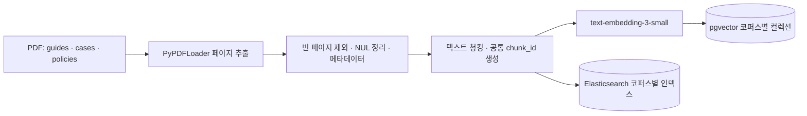
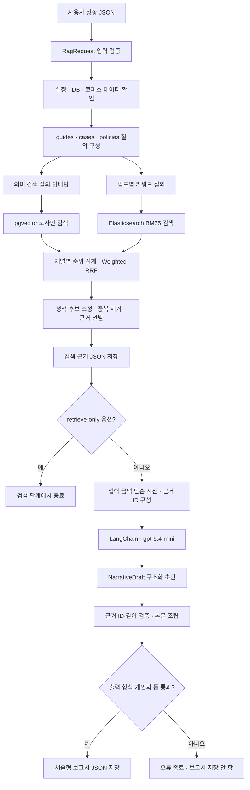

# 현재 구현된 RAG 시스템 플로우차트

확인일: 2026-08-31. 소스 코드를 읽어 작성했으며, 이번 작업에서 적재·검색·LLM 호출을 실행하지 않았습니다.

## 1. 현재 구현과 설계 중인 기능의 구분

- 현재 실행 진입점은 `src/run_rag.py`이며 사용자 상황을 JSON 파일로 받습니다.
- 셀렉트 화면과 금액 구간 기반 입력은 설계 방향입니다. 현재 `UserSituation`의 자금·소득 필드는 정수 금액이고, 추가 상황 문자열 필드도 남아 있습니다.
- 생성기에는 입력된 금액만 합산·차감하는 계산 함수가 이미 있습니다. 새로 정리한 비용 추정·금액 구간 처리·보증금 및 월 주거비 역산은 아직 구현하지 않았습니다.
- 지원공고 자격을 충족·불충족으로 확정하는 별도 룰엔진은 없습니다. 조건에 따라 검색어를 구성하는 분기는 있지만 자격 판정과는 다릅니다.
- 기본 실행은 pgvector와 Elasticsearch를 함께 사용하는 하이브리드 RAG입니다. 두 검색 채널은 논리적으로 나뉘지만 현재 코드는 코퍼스별로 벡터 검색 후 키워드 검색을 순차 실행합니다.

## 2. 사전 준비: PDF 적재



pgvector 적재와 Elasticsearch 적재는 각각 별도 명령으로 실행합니다. 위의 전처리·청킹은 두 적재 코드가 공유하는 함수 흐름을 나타냅니다. pgvector에서 Elasticsearch로 데이터를 복제하는 구조가 아닙니다.

- pgvector 진입점: `src/ingestion/ingest.py`
- Elasticsearch 진입점: `src/ingestion/elasticsearch.py`
- 공통 전처리: `src/ingestion/pdf_pipeline.py`
- PDF에서 텍스트를 추출하며 이미지 OCR 단계는 없습니다.
- 두 적재 경로 모두 저장 개수와 생성 청크 개수를 비교합니다.
- 보고서를 생성할 때마다 PDF를 다시 적재하지 않습니다. 아래 검색은 이미 적재된 DB를 사용합니다.

## 3. 실제 실행: 입력부터 보고서 저장까지



이 차트는 데이터 처리 관계를 나타냅니다. 두 검색 가지의 병렬 배치는 동시 실행을 뜻하지 않습니다. 입력·설정·검색·초안 검증에서 오류가 나도 해당 단계에서 종료하며, 모든 오류 화살표는 가독성을 위해 생략했습니다.

### 3.1 입력과 질의 구성

`src/run_rag.py`가 `--input` 파일을 읽고 Pydantic의 `RagRequest`로 검증합니다. 현재 입력은 구조화된 JSON이며, 자연어 질문 한 문장을 입력받는 인터페이스나 셀렉트 웹 화면은 아닙니다.

- 벡터 질의: `src/retrieval/rag_pipeline.py`의 `build_search_queries()`.
- 키워드 질의: `src/retrieval/keyword_query_builder.py`의 `build_structured_keyword_queries()`.
- 벡터 질의는 목적·지역·주거 선호·시기·우선순위·추가 상황 등을 템플릿에 반영합니다. 자금·소득 정수 필드를 모두 이어 붙이는 구조는 아닙니다.
- 키워드 질의는 코퍼스별로 연령·지역·주거 선호·고용·학업 상태 등의 필드를 사용합니다. 이 분기는 검색 대상 주제를 정하는 것이며 정책 조건을 통과했다고 판정하는 것이 아닙니다.
- 정책 질의에는 현재 `2026`이 코드에 직접 들어 있습니다. 공고 자동 최신화 기능을 의미하지 않습니다.

### 3.2 하이브리드 검색과 근거 선별

실행 함수는 `src/retrieval/hybrid_pipeline.py`의 `retrieve_hybrid_evidence()`입니다.

1. 세 코퍼스의 pgvector 컬렉션과 Elasticsearch 인덱스에 데이터가 있는지 확인합니다.
2. 코퍼스별로 여러 벡터 질의를 검색하고 순위를 집계합니다.
3. 구조화 필드 기반 키워드 질의를 BM25로 검색하고 순위를 집계합니다.
4. 서로 다른 원점수를 직접 더하지 않고 채널 순위에 Weighted RRF를 적용합니다.
5. policies에서 키워드 채널에 잡힌 후보가 있으면 해당 후보들로 좁힙니다. 없으면 결합된 후보를 유지합니다. 이는 자격 검증이 아닙니다.
6. 서로 다른 출처를 우선 선택하고, 같은 문서의 추가 근거는 다른 페이지에서 확보합니다.

현재 코드의 선별 한도는 guides 4개, cases 3개, policies 4개로 합계 최대 11개입니다. 각 근거 본문은 약 400자 이내로 줄인 뒤 필요한 경우 말줄임표를 붙입니다.

검색 근거 파일에는 사용자 상황과 함께 코퍼스·원본 파일명·페이지·본문·검색 채널·RRF 점수·일치 질의가 저장됩니다. 파일 경로는 `--evidence-output`으로 지정합니다.

### 3.3 현재 존재하는 계산

`src/generation/report_generator.py`의 `_build_financial_context()`는 입력값만 사용합니다.

- 입력된 월세·관리비·기존 고정비·대출 상환액 합산.
- 입력된 식비·교통비·공과금·통신비를 추가한 지출 합계.
- 월 소득에서 위 합계를 차감한 잔액.
- 가용 자금에서 보증금을 차감한 잔액.
- 보증금과 이사비가 입력된 경우 두 항목을 차감한 잔액.

없는 비용을 자료에서 추정하거나 새 역산식을 적용하지 않습니다. 미입력 항목을 제외한 부분 계산이라는 안내를 생성 입력에 함께 넣습니다. 계산 결과는 현재 최종 보고서 JSON의 별도 필드로 출력되지 않고 LLM 입력에 포함됩니다.

### 3.4 증강·생성과 검증

`generate_narrative_report()`가 다음을 생성 입력으로 조립합니다.

- 사용자 상황.
- 입력 금액의 단순 계산 결과.
- 실행일 기준 날짜.
- 검색 근거 본문과 내부 ID: guides는 G, cases는 C, policies는 P 접두사.

LangChain의 `ChatPromptTemplate`과 `ChatOpenAI.with_structured_output()`으로 `NarrativeDraft`를 생성합니다. 설정에서 허용하는 생성 모델은 `gpt-5.4-mini`입니다.

내부 초안에는 독립 판단, 실행 순서, 주의점, 정책 설명 및 문단별 근거 ID가 들어갑니다. 이후 프로그램이 근거 ID와 문단 길이를 확인하고 제목·문단을 조립합니다.

출력 검증은 형식·필수 주제·개인화 문자열·중복 문장·근거에 없는 비율 등을 확인합니다. 근거 ID 검사나 비율 검사는 모든 주장의 사실성, 금액 정확성, 정책 최신성을 완전히 검증하는 절차가 아닙니다. 검증 실패를 LLM에 전달해 자동 수정하는 별도 루프도 현재 없습니다.

### 3.5 최종 출력

최종 `NarrativeReport`는 다음 두 필드로 저장됩니다.

```json
{
  "report_title": "보고서 제목",
  "report_body_markdown": "네 개의 소제목과 문단으로 구성된 본문"
}
```

본문의 네 주제는 독립 판단, 집 탐색·계약·이사 순서, 주의점, 지원정책입니다. 사용자 본문에는 내부 근거 ID·PDF 파일명·출처 표기를 제거하거나 검증으로 차단합니다. 원본 검색 출처는 앞서 저장한 근거 JSON에서 확인할 수 있습니다.

현재 실행은 내부 초안의 문단별 근거 ID 목록을 별도 파일로 저장하지 않습니다. 따라서 검색 근거 전체는 남지만 최종 문장과 근거의 상세 매핑까지 영구 저장하는 구조는 아닙니다.

## 4. 별도로 실행되는 경로

- `src/generation/generate_report.py`: 저장된 검색 근거 JSON을 받아 생성 단계만 실행할 수 있습니다. 새 검색을 자동 실행하지 않습니다.
- `src/retrieval/rag_pipeline.py`: vector-only 검색 함수도 남아 있지만 `src/run_rag.py`의 기본 호출 경로는 하이브리드입니다.
- `src/ragas/`의 데이터셋 생성·응답 생성·평가 코드는 별도 평가 경로입니다. 기본 보고서 실행이 끝날 때 RAGAS가 자동 실행되는 것은 아닙니다.

## 5. 코드 확인 위치

| 역할 | 파일 및 함수 |
| --- | --- |
| 실제 실행 진입점 | `src/run_rag.py`: `main()` |
| 입력·초안·출력 스키마 | `src/generation/report_schema.py` |
| 하이브리드 검색 | `src/retrieval/hybrid_pipeline.py`: `retrieve_hybrid_evidence()` |
| 벡터 질의 구성 | `src/retrieval/rag_pipeline.py`: `build_search_queries()` |
| 키워드 질의 구성 | `src/retrieval/keyword_query_builder.py`: `build_structured_keyword_queries()` |
| BM25 질의·채널 순위 집계 | `src/common/elasticsearch_store.py` |
| 계산·생성·검증·조립 | `src/generation/report_generator.py` |
| 모델·코퍼스 설정 | `src/config.py` |

다이어그램 작성 시 실제 호출 관계와 저장 시점을 코드에서 대조했습니다. 셀렉트 화면, 비용 추정·역산, 정책 자격 룰엔진, 대시보드를 현재 구현된 단계로 추가하지 않았습니다.
