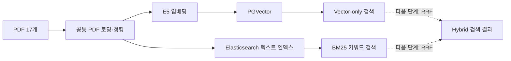
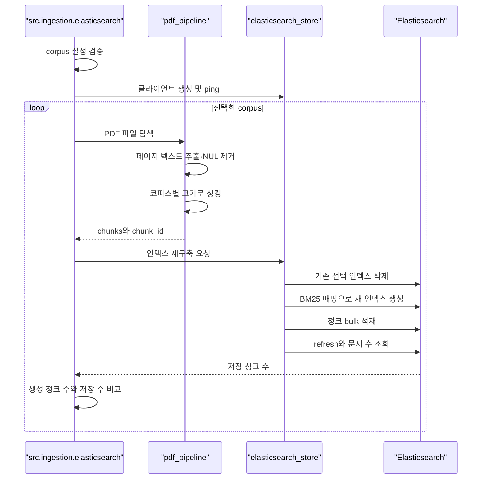

# Elasticsearch 키워드 검색 구현 흐름 설명서

## 1. 문서 목적

이 문서는 기존 PGVector Vector-only 검색을 보존하면서 Elasticsearch BM25 키워드 검색을 추가한 현재 구현의 흐름을 설명한다. PDF가 Elasticsearch 인덱스에 들어가는 과정, 사용자가 검색어를 입력했을 때 결과가 반환되는 과정, 자동 평가 결과가 어디에 저장되는지를 코드 기준으로 정리한다.

이번 구현은 하이브리드 RAG의 완성이 아니다. 현재는 Vector 검색과 Keyword 검색을 서로 독립적으로 실행하고 평가할 수 있는 단계다. 두 결과를 RRF로 결합해 실제 보고서 생성에 사용하는 작업은 다음 단계다.

## 먼저 알아야 할 핵심 개념

### Elasticsearch란 무엇인가

Elasticsearch는 많은 문서에서 사용자가 입력한 단어나 문장을 빠르게 찾기 위한 검색 엔진이다. 일반 데이터베이스처럼 JSON 문서를 저장할 수 있지만, 주된 목적은 행을 정확히 조회하는 것이 아니라 텍스트를 분석하고 관련성이 높은 문서를 순서대로 반환하는 것이다.

Elasticsearch에 문서를 저장하면 본문을 검색할 때마다 모든 문서를 처음부터 읽지 않는다. 문서에 등장하는 단어와 그 단어가 들어 있는 문서 위치를 미리 정리한 **역색인(inverted index)**을 만든다.

예를 들어 다음 세 청크가 있다고 가정한다.

```text
청크 A: 청년 월세 지원 신청 조건
청크 B: 임대차 계약과 월세 납부
청크 C: 청년 이사비 지원 사업
```

Elasticsearch는 내부적으로 다음과 비슷한 검색용 목록을 만든다.

```text
청년   → A, C
월세   → A, B
지원   → A, C
계약   → B
이사비 → C
```

사용자가 `청년 월세 지원`을 검색하면 전체 청크를 순서대로 읽는 대신 `청년`, `월세`, `지원`의 역색인을 조회한다. 그래서 문서 수가 많아져도 키워드가 들어 있는 후보를 빠르게 찾을 수 있다.

이 프로젝트에서는 하나의 PDF 전체를 Elasticsearch 문서 하나로 저장하지 않는다. 기존 PGVector 적재와 동일하게 PDF를 페이지 기반 청크로 나누고, 청크 하나를 Elasticsearch 문서 하나로 저장한다. 이 덕분에 검색 결과에서 원본 PDF 파일명과 실제 페이지를 함께 반환할 수 있다.

### BM25란 무엇인가

BM25는 Elasticsearch가 텍스트 검색 결과의 관련성을 계산할 때 사용하는 대표적인 순위 산정 알고리즘이다. 쉽게 말하면 **검색어가 어떤 청크에서 얼마나 중요하게 등장했는지 계산해 점수를 주는 방식**이다.

BM25는 단순히 검색어가 많이 등장하는 문서를 무조건 높은 순위에 두지 않는다. 주로 다음 요소를 함께 고려한다.

1. 검색어가 해당 청크에 등장하는 횟수
2. 검색어가 전체 문서에서 얼마나 희귀한 단어인지
3. 해당 청크가 지나치게 길어서 검색어가 우연히 많이 포함된 것은 아닌지

예를 들어 `청년월세지원`이라는 정책명이 특정 정책 공고에만 등장한다면 희귀하고 구체적인 단어이므로 높은 구분력을 갖는다. 반면 `지원`, `신청`, `조건`처럼 거의 모든 정책 공고에 등장하는 단어는 문서를 구분하는 힘이 약하므로 상대적으로 낮은 영향을 받는다.

BM25 점수는 일반적으로 **높을수록 현재 검색어와 관련성이 높은 결과**라는 뜻이다. 다만 점수는 같은 검색을 수행한 결과 안에서 순위를 정하기 위한 값이다. 다른 검색어에서 나온 BM25 점수와 절대적인 크기를 비교하거나 PGVector의 코사인 거리와 직접 더하면 안 된다.

### Vector 검색과 BM25 검색의 차이

PGVector 검색과 Elasticsearch BM25 검색은 서로 대체 관계가 아니라 장점이 다른 보완 관계다.

| 구분 | PGVector Vector 검색 | Elasticsearch BM25 검색 |
|---|---|---|
| 검색 기준 | 문장 전체의 의미적 유사성 | 실제로 등장한 단어와 표현 |
| 강점 | 질문과 문서의 표현이 달라도 의미가 비슷하면 검색 가능 | 정책명, 지역명, 계약 용어, 숫자처럼 정확한 표현 검색에 강함 |
| 약점 | 고유명사나 정확한 사업명을 놓칠 수 있음 | 같은 의미를 다른 단어로 표현하면 놓칠 수 있음 |
| 점수 해석 | 코사인 거리가 낮을수록 유사함 | BM25 점수가 높을수록 관련성이 높음 |

예를 들어 사용자가 `집주인이 진짜 소유자인지 확인하는 법`이라고 질문하고 문서에는 `등기사항증명서의 소유자와 계약 상대방 일치 여부`라고 적혀 있다면 Vector 검색이 유리하다. 반대로 사용자가 `서울 청년월세지원`처럼 정확한 사업명을 입력하면 BM25 검색이 유리하다.

### 이 프로젝트에서 Elasticsearch를 추가한 이유

기존 Vector-only 평가에서는 안내서와 사례 검색은 좋았지만 일부 정책 비교 질문에서 정확한 정책 공고를 동시에 가져오지 못했다. 정책 문서에는 `지원`, `대상`, `신청`, `소득`처럼 여러 공고에서 반복되는 표현이 많고, 하나의 질문에 두 개 이상의 정확한 정책명이 들어갈 수 있기 때문이다.

따라서 현재 구조에서는 다음처럼 역할을 나눈다.

```text
PGVector
→ 사용자의 자연스러운 표현과 의미가 비슷한 청크 검색

Elasticsearch + BM25
→ 정책명·지역명·계약 용어가 실제로 포함된 청크 검색

다음 단계의 RRF
→ 두 검색 결과의 순위를 안전하게 결합
```

Elasticsearch가 자체적으로 벡터 검색 기능도 제공하지만 현재 프로젝트에서는 사용하지 않는다. 벡터 검색은 이미 PGVector에 정상적으로 구현되어 있으므로 Elasticsearch에는 임베딩을 중복 저장하지 않고 BM25 키워드 검색만 맡긴다.

## 2. 현재 검색 구성



두 검색 시스템의 역할은 다음과 같다.

| 검색 방식 | 저장소 | 역할 | 현재 상태 |
|---|---|---|---|
| Vector 검색 | PostgreSQL PGVector | 표현이 달라도 의미가 유사한 청크 검색 | 실제 RAG 보고서 생성에 사용 중 |
| Keyword 검색 | Elasticsearch | 정책명, 계약 용어, 지역명 등 정확한 단어 검색 | 독립 적재·검색·평가 구현 완료 |
| Hybrid 검색 | PGVector + Elasticsearch | 두 검색 순위를 결합 | 아직 미구현 |

## 3. Vector-only 기준선 보존

하이브리드 검색 적용 전의 검색 성능은 다음 디렉터리에 복사해 보존했다.

```text
evaluation/baselines/vector_only_2026-08-17/
├─ README.md
├─ retrieval_questions.jsonl
├─ retrieval_results.csv
├─ retrieval_summary.json
└─ retrieval_evaluation_report.md
```

기준선은 다음과 같다.

| 지표 | 결과 |
|---|---:|
| 평가 질문 | 15개 |
| Source Hit@3 | 86.67% |
| 기대 문서 평균 회수율 | 86.67% |
| MRR | 0.9222 |

보존 파일은 기존 평가 파일과 SHA-256 해시가 일치하는 것을 확인했다. 이후 Vector 검색을 다시 평가하거나 Keyword·Hybrid 평가를 실행해도 이 디렉터리의 기준선은 덮어쓰지 않는다.

## 4. 관련 파일과 책임

| 파일 | 책임 |
|---|---|
| `src/config.py` | Elasticsearch URL, 인증, 타임아웃과 인덱스 접두어 설정 |
| `src/ingestion/pdf_pipeline.py` | PDF 탐색, 페이지 추출, 텍스트 정리와 코퍼스별 청킹 |
| `src/ingestion/elasticsearch.py` | 청크 생성부터 코퍼스별 Elasticsearch 인덱스 재구축까지 실행 |
| `src/common/elasticsearch_store.py` | 클라이언트 생성, 매핑, 벌크 적재, BM25 질의와 응답 변환 |
| `src/retrieval/keyword_search.py` | 사용자가 직접 키워드 검색을 실행하는 CLI |
| `src/retrieval/keyword_query_builder.py` | 연령·지역·주거·고용·학업 상태에서 코퍼스별 하위 질의 생성 |
| `src/retrieval/structured_keyword_search.py` | 실제 `RagRequest` JSON을 이용한 구조화 Keyword 검색 CLI |
| `src/retrieval/evaluate_keyword_retrieval.py` | Keyword 전용 하위 질의 15개로 검색을 자동 평가 |
| `evaluation/baselines/vector_only_2026-08-17/` | 변경하지 않는 Vector-only 비교 기준 |
| `evaluation/keyword/` | 긴 자연어 질문을 사용했던 최초 Keyword 평가 기준선 |
| `evaluation/keyword_structured/` | 개선된 구조화 Keyword 평가 결과 경로 |

## 5. Elasticsearch 실행 환경

`compose.yaml`에는 다음 Elasticsearch 서비스가 추가되어 있다.

```text
서비스 이름: elasticsearch
컨테이너 이름: youth-rag-elasticsearch
버전: Elasticsearch 8.13.0
접속 주소: http://localhost:9200
실행 형태: single-node
개발 환경 보안: 비활성화
기본 JVM 메모리: 최소 512MB, 최대 512MB
```

PGVector와 Elasticsearch는 서로 다른 Docker 볼륨을 사용한다.

```text
pgvector_data       → PostgreSQL과 벡터 데이터
elasticsearch_data  → BM25 텍스트 인덱스
```

Elasticsearch 컨테이너를 중지하거나 다시 시작해도 볼륨을 삭제하지 않는 한 인덱스는 유지된다.

## 6. 환경변수 입력

Elasticsearch 설정은 프로젝트 루트의 `.env`에서 읽는다.

```dotenv
ELASTICSEARCH_URL=http://localhost:9200
ELASTICSEARCH_USERNAME=
ELASTICSEARCH_PASSWORD=
ELASTICSEARCH_VERIFY_CERTS=false
ELASTICSEARCH_REQUEST_TIMEOUT=30
ELASTICSEARCH_INDEX_PREFIX=youth_independence
```

기본 Docker 구성은 인증을 사용하지 않으므로 사용자 이름과 비밀번호를 비워 둔다. 보안이 설정된 외부 Elasticsearch를 사용하면 두 값을 모두 입력해야 한다. 둘 중 하나만 입력하면 설정 검증에서 오류가 발생한다.

## 7. Elasticsearch 적재 입력

적재 입력은 PGVector와 동일한 활성 PDF다.

```text
knowledge_base/pdfs/guides/*.pdf
knowledge_base/pdfs/cases/*.pdf
knowledge_base/pdfs/policies/*.pdf
```

별도의 `data/*.txt` 폴더를 사용하지 않으며 Ollama 임베딩도 생성하지 않는다. 따라서 PGVector와 Elasticsearch는 같은 원본 PDF와 같은 청킹 기준을 사용한다.

CLI 입력은 다음 두 항목이다.

| 인자 | 값 | 의미 |
|---|---|---|
| `--corpus` | `guides`, `cases`, `policies`, `all` | 적재할 문서 그룹, 기본값은 `all` |
| `--dry-run` | 선택 플래그 | PDF 로딩과 청킹까지만 실행하고 Elasticsearch는 변경하지 않음 |

## 8. 적재 처리 흐름



처리 순서는 다음과 같다.

1. 코퍼스와 Elasticsearch 환경설정을 검증한다.
2. `--dry-run`이 아니면 Elasticsearch 연결을 확인한다.
3. 선택한 PDF 폴더에서 파일을 찾는다.
4. `PyPDFLoader`로 페이지 텍스트를 추출한다.
5. 빈 페이지를 제외하고 PostgreSQL과 Elasticsearch에 부적합한 NUL 문자를 제거한다.
6. PGVector 적재와 동일한 크기와 중첩으로 청크를 생성한다.
7. 문서 해시, 페이지, 청크 순번과 본문으로 결정적인 `chunk_id`를 만든다.
8. 선택한 Elasticsearch 인덱스가 있으면 삭제한다.
9. 텍스트 검색용 매핑으로 인덱스를 다시 만든다.
10. 청크를 `_id=chunk_id`로 벌크 적재한다.
11. 인덱스를 refresh한 뒤 저장된 문서 수를 조회한다.
12. 생성 청크 수, bulk 성공 수와 실제 저장 수가 모두 일치해야 성공한다.

## 9. 코퍼스별 인덱스 출력

기본적으로 다음 인덱스가 생성된다.

| 코퍼스 | Elasticsearch 인덱스 |
|---|---|
| `guides` | `youth_independence_guides_keywords` |
| `cases` | `youth_independence_cases_keywords` |
| `policies` | `youth_independence_policies_keywords` |

`ELASTICSEARCH_INDEX_PREFIX`를 변경하면 앞부분인 `youth_independence`가 변경된다.

선택한 인덱스는 적재할 때 삭제하고 재생성한다. 예를 들어 `--corpus policies`를 실행하면 정책 인덱스만 변경되고 guides와 cases 인덱스 및 모든 PGVector 컬렉션에는 영향을 주지 않는다.

## 10. Elasticsearch 문서 구조

하나의 청크는 다음 형태로 저장된다.

```json
{
  "content": "PDF에서 추출하고 정규화한 청크 본문",
  "source_file": "원본파일.pdf",
  "corpus": "policies",
  "page_number": 12,
  "chunk_id": "SHA-256 문자열",
  "document_title": "2026년 서울시 청년월세지원 모집공고",
  "policy_name": "서울 청년월세지원",
  "keywords": ["청년 월세 지원", "신청자격", "소득", "보증금"],
  "metadata": {
    "source": "knowledge_base/pdfs/policies/원본파일.pdf",
    "source_file": "원본파일.pdf",
    "corpus": "policies",
    "knowledge_role": "policies",
    "document_sha256": "원본 PDF SHA-256",
    "page_number": 12,
    "chunk_index": 0,
    "chunk_id": "SHA-256 문자열",
    "character_count": 847
  }
}
```

| 필드 | 검색 사용 여부 | 역할 |
|---|---|---|
| `content` | 사용 | BM25가 검색하는 청크 본문 |
| `source_file` | 사용 | 정책명이나 파일명 표현 검색 및 결과 출처 표시 |
| `corpus` | 필터·식별 | 문서 그룹 구분 |
| `page_number` | 결과 표시 | 원문 페이지 추적 |
| `chunk_id` | 중복 식별 | PGVector 청크와 동일한 청크 연결 가능 |
| `document_title` | 높은 가중치 검색 | 영문 파일명 대신 사용하는 한국어 문서 제목 |
| `policy_name` | 가장 높은 가중치 검색 | 공식 정책명과 서비스 입력 연결 |
| `keywords` | 높은 가중치 검색 | 정책 별칭과 문서별 핵심 검색어 |
| `metadata` | 검색하지 않음 | 원본 추적에 필요한 전체 메타데이터 보존 |

`metadata`는 Elasticsearch 분석 대상에서 제외하지만 `_source`에는 보존한다.

## 11. BM25 매핑과 검색 방식

플러그인 설치 없이 실행할 수 있도록 기본 `standard` 분석기와 2~15자 n-gram 보조 필드를 함께 사용한다. 공백이 정상인 본문은 `standard` 필드에서 검색하고, `허가받은이사업체`처럼 한국어가 붙어서 추출된 본문은 `content.ngram`이 `이사업체`, `방문견적` 같은 부분 문자열 회수를 보완한다.

영문 `source_file` 외에 한국어 `document_title`, 공식 `policy_name`, 별칭과 핵심 용어인 `keywords`를 별도 필드에 적재한다. 가중치는 정책명, 한국어 제목, 키워드, 파일명, 본문, n-gram 본문 순으로 높게 설정한다.

하나의 검색어에 대해 두 종류의 질의를 `should` 조건으로 실행한다.

1. `match_phrase`는 본문과 한국어 제목·정책명에 검색 표현이 연속해서 등장할 때 높은 가중치를 준다.
2. `multi_match`는 정책명, 제목, 키워드, 파일명, 기본 본문과 n-gram 본문을 함께 검색한다.
3. 여러 구조화 하위 질의의 원시 BM25 점수를 직접 비교하지 않고 질의별 순위를 RRF로 결합한다.
4. 동일 `chunk_id`는 하나로 합치고 최종 Top-K에서는 서로 다른 원본 PDF를 우선한다.

Elasticsearch는 이 조건으로 BM25 점수를 계산한다. 점수가 높을수록 Keyword 검색에서 관련성이 높은 결과다.

BM25 점수와 PGVector 코사인 거리는 의미와 범위가 다르므로 직접 더하지 않는다. 다음 Hybrid 단계에서는 점수 대신 각 검색의 순위를 이용하는 RRF를 적용해야 한다.

## 12. 키워드 검색 입력과 출력

키워드 검색 CLI 입력은 다음과 같다.

```powershell
.venv\Scripts\python.exe -m src.retrieval.keyword_search `
  "서울 청년월세지원 소득 임차 조건" `
  --corpus policies `
  -k 3
```

| 입력 | 의미 |
|---|---|
| 위치 인자 `query` | 검색할 한국어 질의 |
| `--corpus` | 검색할 하나의 코퍼스 또는 `all` |
| `-k` | 인덱스별 반환할 청크 수, 기본값 3 |

검색 과정은 다음과 같다.

```text
사용자 query
→ 공백 정규화
→ 코퍼스 인덱스 존재 여부 및 저장 문서 수 확인
→ match_phrase + multi_match BM25 검색
→ Elasticsearch _source 읽기
→ LangChain Document로 변환
→ BM25 점수와 출처를 콘솔에 출력
```

콘솔 출력 형태는 다음과 같다.

```text
[keyword-search] corpus=policies, index=..., query='...', results=3
1. bm25_score=12.3456 source=정책공고.pdf page=3
   검색된 본문 미리보기...
```

`--corpus all -k 3`은 전체에서 3개를 반환하는 것이 아니라 세 인덱스에서 각각 최대 3개를 반환한다.

실제 서비스 입력에서는 수동 문장 검색보다 구조화 검색을 사용한다.

```powershell
.venv\Scripts\python.exe -m src.retrieval.structured_keyword_search `
  --input examples\inputs\real_rag_input.json `
  --corpus all `
  -k 3
```

입력의 목표 지역, 주거 형태, 연령, 무주택 여부, 고용 상태와 학업 상태 중 각 코퍼스에 필요한 값만 선택한다. 예를 들어 월세·서울·재직 상태이면 청년월세지원, 중개보수·이사비, 희망두배 청년통장에 대한 별도 정책 하위 질의를 만든다. 이는 정책 자격을 규칙으로 판정하는 것이 아니라 검색 후보를 찾기 위한 query routing이다.

## 13. Keyword 자동 평가 입력

평가 입력은 Keyword 검색용으로 분리한 파일이다.

```text
evaluation/keyword_retrieval_questions.jsonl
```

각 질문에는 다음 값이 포함된다.

- 질문 ID
- 검색할 코퍼스
- 사용자가 원하는 정보의 짧은 설명
- 구조화 입력에서 생성되는 것과 같은 `keyword_queries` 배열
- 기대하는 원본 PDF 목록
- 최소 기대 문서 적중 수
- Top-K

기대 문서는 기존 Vector 평가와 동일하게 유지하되 검색 입력만 Keyword에 적합한 짧은 하위 질의로 분리한다. 따라서 긴 문장 작성 방식의 영향을 줄이고 Keyword 검색기가 정확한 용어와 정책명을 회수하는지를 평가한다.

## 14. Keyword 자동 평가 출력

평가 명령은 다음과 같다.

```powershell
.venv\Scripts\python.exe -m src.retrieval.evaluate_keyword_retrieval
```

결과는 Vector 평가 파일과 다른 경로에 저장된다.

```text
evaluation/keyword_structured/
├─ retrieval_results.csv
└─ retrieval_summary.json
```

CSV에는 질문별로 다음 값이 저장된다.

- Source Hit 성공 여부
- 기대 문서 회수율
- 첫 기대 문서 순위
- Reciprocal Rank
- 순위별 원본 PDF와 페이지
- 순위별 하위 질의 RRF 점수와 최고 BM25 점수
- 각 청크가 적중한 하위 질의
- 청크 본문 미리보기

JSON에는 전체 및 코퍼스별 Source Hit 비율, 기대 문서 평균 회수율과 MRR이 저장된다.

## 15. 실행 순서

프로젝트 루트에서 다음 순서로 실행한다.

### 15.1 Elasticsearch 시작

```powershell
docker compose up -d elasticsearch
docker compose ps
```

### 15.2 변경 없는 PDF·청킹 검증

```powershell
.venv\Scripts\python.exe -m src.ingestion.elasticsearch --corpus all --dry-run
```

### 15.3 실제 인덱스 적재

```powershell
.venv\Scripts\python.exe -m src.ingestion.elasticsearch --corpus all
```

### 15.4 대표 질문 수동 검색

```powershell
.venv\Scripts\python.exe -m src.retrieval.keyword_search `
  "서울 청년월세지원 소득 임차 조건" `
  --corpus policies `
  -k 3
```

### 15.5 전체 질문 자동 평가

```powershell
.venv\Scripts\python.exe -m src.retrieval.evaluate_keyword_retrieval
```

### 15.6 기준선 비교

```text
Vector-only 기준선
evaluation/baselines/vector_only_2026-08-17/retrieval_summary.json

기존 긴 자연어 Keyword 기준선
evaluation/keyword/retrieval_summary.json

개선된 구조화 Keyword 결과
evaluation/keyword_structured/retrieval_summary.json
```

## 16. 현재 검증된 사항

구현 직후 다음 내용을 검증했다.

- Python 전체 소스 컴파일 성공
- Docker Compose에서 `pgvector`, `elasticsearch` 두 서비스 구성 확인
- Elasticsearch BM25 질의 구조 생성 성공
- 모의 Elasticsearch 응답을 LangChain `Document`로 변환 성공
- Vector 기준선 복사본과 원본 파일의 SHA-256 일치
- guides PDF dry-run 성공
- guides PDF 4개, 텍스트 128페이지, 청크 272개 확인
- 기존 PGVector guides 청크 272개와 동일

긴 자연어 질문을 사용한 최초 Keyword 평가는 Source Hit@3 80.0%, MRR 0.7556이었다. 이후 구조화 입력 스키마, 한국어 검색 메타데이터, n-gram 보조 필드, 하위 질의 생성과 source 다양화를 구현했다. 새 Elasticsearch 매핑의 실제 적재와 `keyword_structured/` 재평가는 사용자가 실행하도록 남겨 두었으므로 개선 후 수치는 아직 생성되지 않았다.

## 17. 기존 원본 파일에서 변경된 점

기존 `src/ingestion/elasticsearch.py`는 `./data/*.txt`를 읽고 Ollama 임베딩과 Elasticsearch dense vector를 생성하는 독립 예제였다. 또한 접속 계정이 코드에 고정되어 있었고 존재하지 않는 `common.elasticsearch_vector`를 참조했다.

개선된 구현은 다음과 같이 변경되었다.

| 기존 | 개선 |
|---|---|
| `./data/*.txt` 입력 | 현재 활성 PDF 17개 입력 |
| 300자·30자 고정 청킹 | 코퍼스별 기존 청킹 설정 재사용 |
| Ollama 임베딩 생성 | 임베딩 없이 BM25 텍스트만 저장 |
| Elasticsearch dense vector 검색 | PGVector는 Vector, Elasticsearch는 Keyword로 역할 분리 |
| 계정과 비밀번호 하드코딩 | `.env` 기반 선택적 인증 |
| 파일 실행 즉시 연결·삭제 | `main()`과 CLI 인자로 실행 제어 |
| 단일 `rag_keywords` 인덱스 | guides·cases·policies 별도 인덱스 |
| 정수 순번 ID | PGVector와 동일한 결정적 `chunk_id` |
| 저장 건수 검증 없음 | 청크·bulk·실제 count 일치 검증 |

## 18. 다음 구현 단계

다음 단계에서는 사용자가 Elasticsearch를 새 매핑으로 적재하고 구조화 Keyword 평가를 실행한다. 개선 결과가 확인되면 Vector와 Keyword 후보를 각각 더 넓게 가져온 뒤 `chunk_id`를 기준으로 중복을 합치고 두 검색기 사이의 RRF 점수를 계산한다.

```text
Vector Top-N ─┐
              ├─ RRF → 중복 제거 → 출처 다양화 → 최종 Top-K
Keyword Top-N ┘
```

RRF 구현 후에도 Vector-only와 Keyword-only 결과는 유지한다. 세 결과를 같은 평가 데이터로 비교한 뒤 Hybrid 결과가 실제 보고서 생성 경로의 `retrieve_real_evidence()`를 대체할지 결정한다.
