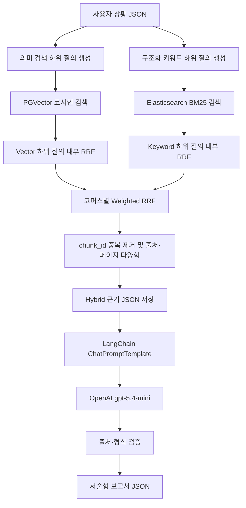

# Hybrid RAG 구현 흐름 설명서

## 1. 문서 목적

이 문서는 청년 자취 독립 플래너의 실제 보고서 생성 경로에 적용된 Hybrid 검색을 설명한다. PGVector의 의미 검색과 Elasticsearch BM25 키워드 검색을 왜 함께 사용하는지, 서로 다른 점수를 어떻게 Weighted RRF로 결합하는지, 어떤 근거가 LangChain과 OpenAI LLM에 전달되는지 코드 기준으로 정리한다.

현재 Hybrid 검색은 기존 Vector-only 기준선을 삭제하거나 대체하지 않는다. Vector-only 코드는 비교 평가를 위해 남겨 두고, 서비스 실행 진입점인 `src.run_rag`만 새 Hybrid 검색 경로를 사용한다.

## 2. Hybrid 검색이란 무엇인가

Hybrid 검색은 서로 다른 검색 방식의 장점을 함께 이용하는 방법이다. 이 프로젝트에서는 다음 두 검색기를 결합한다.

| 검색기 | 저장소 | 잘 찾는 정보 |
|---|---|---|
| Vector 검색 | PostgreSQL PGVector | 표현은 다르지만 의미가 비슷한 생활 경험, 고민, 행동 방법 |
| Keyword 검색 | Elasticsearch BM25 | 정책명, 지역명, 연도, 법률 용어, 신청 조건처럼 정확한 표현 |

예를 들어 사용자가 `집주인이 실제 소유자인지 확인하고 싶다`고 입력하고 문서에는 `등기사항증명서의 소유자와 계약 상대방을 대조한다`고 적혀 있다면 Vector 검색이 유리하다. 반대로 `2026 서울 청년월세지원`처럼 정확한 정책명과 지역·연도가 중요하면 Keyword 검색이 유리하다.

한 검색기가 다른 검색기를 대체하는 구조가 아니다. 두 검색기가 독립적으로 후보 청크를 찾고, 결합 단계가 최종 순위를 만든다.

## 3. RRF란 무엇인가

RRF는 Reciprocal Rank Fusion의 약자이며 여러 검색 결과를 **원시 점수가 아닌 순위**로 결합하는 방법이다.

PGVector는 코사인 거리를 반환하고 Elasticsearch는 BM25 점수를 반환한다. 다음 숫자는 계산 기준과 범위가 다르므로 직접 더할 수 없다.

```text
PGVector 코사인 거리: 0.31
Elasticsearch BM25: 42.8
```

RRF는 각 검색기에서 몇 위였는지만 이용한다.

```text
RRF 기여도 = 검색기 가중치 / (RRF 상수 + 검색 순위)
```

동일 청크가 Vector 1위와 Keyword 3위에 등장했다면 두 기여도를 더한다. 한 검색기에만 등장한 청크도 제외하지 않지만, 양쪽에서 상위에 등장한 청크가 일반적으로 더 높은 결합 점수를 받는다.

이 프로젝트의 RRF 상수는 60이다. 이 값은 Top 1 하나가 전체 결과를 지나치게 지배하지 않도록 순위 간 차이를 완만하게 만든다.

## 4. 코퍼스별 가중치

검색 역할이 코퍼스마다 다르므로 모든 문서에 같은 가중치를 적용하지 않는다.

| 코퍼스 | Vector | Keyword | 이유 |
|---|---:|---:|---|
| guides | 0.60 | 0.40 | 자연스러운 질문과 안내 문단의 의미 대응이 중요함 |
| cases | 0.60 | 0.40 | 실제 경험과 사용자 상황의 의미적 유사성이 중요함 |
| policies | 0.45 | 0.55 | 정책명, 지역, 연도, 고용·학업 상태 등 정확한 조건이 더 중요함 |

정책에서 Keyword 비중을 조금 높인 이유는 의미가 비슷하더라도 사용자 상태와 맞지 않는 정책이 Vector-only 결과로 선택되는 현상을 줄이기 위해서다. 이 가중치는 평가로 확정된 최종값이 아니라 현재 문서와 초기 검색 결과에 맞춘 시작값이다.

정책 코퍼스에는 추가 안전장치가 있다. 지역·나이·주거 형태·고용·학업 상태를 반영한 구조화 Keyword 검색에서 한 번도 발견되지 않은 Vector-only 정책은 최종 정책 근거에서 제외한다. 가이드와 사례는 자연어 의미 대응이 중요하므로 Vector-only 후보를 허용한다. 이는 정책 자격을 확정하는 룰 엔진이 아니라, 사용자 조건과 무관한 정책이 단순한 의미 유사성만으로 보고서에 들어오는 것을 막는 검색 후보 제한이다.

## 5. 전체 실행 흐름



## 6. 관련 파일과 책임

| 파일 | 책임 |
|---|---|
| `src/retrieval/rag_pipeline.py` | 기존 Vector-only 검색과 의미 검색 하위 질의 생성, 기준선 보존 |
| `src/retrieval/keyword_query_builder.py` | 구조화 사용자 필드에서 코퍼스별 Keyword 하위 질의 생성 |
| `src/common/elasticsearch_store.py` | Elasticsearch BM25 검색과 Keyword 내부 RRF |
| `src/retrieval/hybrid_pipeline.py` | 두 저장소 연결, Vector 내부 RRF, Weighted RRF, 중복 제거와 최종 근거 생성 |
| `src/generation/report_schema.py` | 사용자 입력, Hybrid 근거, 내부 보고서 초안과 최종 JSON 검증 |
| `src/generation/report_generator.py` | LangChain과 OpenAI를 이용한 판단 중심 서술형 보고서 생성 |
| `src/run_rag.py` | 입력부터 Hybrid 검색·근거 저장·보고서 생성까지 실행 |

## 7. 사용자 입력

사용자는 검색어를 직접 조합하지 않고 현재 상황을 입력한다. 핵심 필드는 다음과 같다.

| 분류 | 필드 |
|---|---|
| 기본 상황 | 독립 목적, 나이, 고용 상태, 학업 상태, 무주택 여부 |
| 이동 조건 | 현재 지역, 목표 지역, 희망 시기, 선호 주거 형태 |
| 재정 상태 | 월 소득, 사용 가능한 현금 |
| 알아본 매물 | 목표 보증금, 월세, 관리비 |
| 기존 부담 | 주거비 외 고정지출, 월 부채 상환액 |
| 사용자 의도 | 우선순위 배열, 자유 입력 상황 |

알아본 매물이 없으면 목표 보증금·월세·관리비 등은 `null`로 입력할 수 있다. 핵심 비용이 비어 있으면 LLM은 독립 가능성을 확정하지 않고 `조건 확인 후 독립이 적절함`으로 판단하도록 제한된다.

## 8. 검색 질의 생성

### 8.1 Vector 질의

Vector 질의는 사용자의 목적, 이동 지역, 주거 형태, 일정, 우선순위와 자유 입력을 자연스러운 문장으로 조합한다. 가이드에서는 계약·이사·예산, 사례에서는 생활비·소득 공백·지역 이동, 정책에서는 목표 지역의 월세·이사비 지원을 의미 검색한다.

### 8.2 Keyword 질의

Keyword 질의는 모든 필드를 한 문장으로 붙이지 않는다. 코퍼스에서 구분력이 있는 필드만 선택한다.

- guides: 임대차, 등기사항증명서, 확정일자, 견적, 보험, 초기비용
- cases: 연령대, 1인 가구, 생활비, 지역 이동, 통근, 실제 경험
- policies: 연도, 목표 지역, 나이, 무주택 여부, 주거 형태, 고용·학업 상태

월세·재직·서울이라는 입력에서는 청년월세지원, 중개보수·이사비, 근로청년 자산형성 정책을 각각 별도 하위 질의로 만든다.

## 9. 채널 내부 결합

하위 질의 하나만 검색하면 보고서의 여러 주제를 충분히 다루기 어렵다. 따라서 검색기별로 먼저 여러 하위 질의 결과를 RRF로 합친다.

Vector 검색은 하위 질의마다 6개 후보를 가져온다. 각 후보의 코사인 거리를 서로 더하지 않고 하위 질의 안에서의 순위를 RRF로 합친 뒤 최대 12개 채널 후보를 남긴다.

Keyword 검색은 하위 질의마다 8개 후보를 가져온다. 기존 Elasticsearch 검색 모듈이 BM25 순위를 RRF로 합쳐 최대 12개 채널 후보를 반환한다.

## 10. 두 채널의 Weighted RRF

Vector 채널과 Keyword 채널의 후보 순위를 다시 코퍼스별 가중치로 결합한다.

```text
Hybrid 점수
= Vector 가중치  / (60 + Vector 채널 순위)
+ Keyword 가중치 / (60 + Keyword 채널 순위)
```

검색되지 않은 채널의 기여도는 0이다. 동일 청크 판정에는 적재 때 생성한 `chunk_id`를 사용한다. PGVector와 Elasticsearch가 같은 PDF 청킹 파이프라인과 같은 `chunk_id`를 사용하므로 양쪽 검색 결과를 정확히 합칠 수 있다.

다만 정책 코퍼스는 구조화 Keyword 검색에 등장한 후보만 최종 선별 대상으로 삼는다. 그 후보 안에서는 Vector 순위가 여전히 결합 점수에 반영되므로 두 검색기는 함께 작동한다.

## 11. 최종 근거 선별

최종 보고서에 전달하는 최대 근거 수는 다음과 같다.

| 코퍼스 | 최대 개수 |
|---|---:|
| guides | 4 |
| cases | 3 |
| policies | 4 |
| 전체 | 11 |

점수 순서만 사용하면 한 PDF가 결과를 독점할 수 있다. 먼저 서로 다른 출처를 하나씩 선택하고, 남은 자리는 같은 PDF의 다른 페이지를 허용한다. 같은 `chunk_id`와 같은 출처·페이지의 반복 청크는 제외한다. 각 본문은 LLM 입력 크기와 API 비용을 통제하기 위해 최대 400자로 정리한다.

## 12. Hybrid 근거 JSON

`--evidence-output` 파일에는 사용자 입력과 최종 근거가 저장된다.

```json
{
  "corpus": "policies",
  "source_file": "seoul_youth_monthly_rent_notice_2026.pdf",
  "page_number": 1,
  "content": "검색된 실제 PDF 청크...",
  "retrieval_methods": ["keyword", "vector"],
  "hybrid_score": 0.01572421,
  "matched_queries": ["검색에 사용된 하위 질의..."]
}
```

이 파일을 먼저 확인하면 보고서 오류가 검색 때문인지 생성 때문인지 구분할 수 있다. `retrieval_methods`에 두 값이 있으면 양쪽 검색기가 같은 청크를 발견한 것이다. 이 점수와 하위 질의는 추적용 JSON에는 보존하지만 LLM에는 전달하지 않는다. 생성 모델에는 사용자 상황과 코퍼스·파일명·페이지 및 제한된 길이의 근거 본문만 전달해 OpenAI 요청 비용을 통제하고 검색 점수가 서술에 섞이는 것을 막는다. 추적 JSON에는 기존 400자 근거를 그대로 남긴다.

## 13. 보고서 생성

생성에는 LangChain의 `ChatPromptTemplate`, `ChatOpenAI`, `with_structured_output`과 Runnable 파이프라인을 사용한다. 모델은 OpenAI의 `gpt-5.4-mini`다.

LLM은 내부적으로 다음 세 판단 중 하나를 고른다.

- 독립 진행이 적절함
- 조건 확인 후 독립이 적절함
- 현재는 독립 연기 또는 조건 조정이 적절함

이는 정책 자격이나 재무 상태에 대한 법적·전문적 확정 판정이 아니다. 사용자 입력과 검색된 사례·공식 안내를 바탕으로 한 실행 권고다.

생성 입력에는 실행 날짜와 입력값만으로 계산한 월 고정비 합계, 고정비 차감 후 소득, 목표 보증금 차감 후 현금도 함께 제공한다. 이 계산은 독립 가능 여부를 결정하는 룰이 아니라 LLM이 금액을 잘못 더하거나 매달 발생하는 비용을 초기 현금에서 임의로 차감하는 것을 막기 위한 산술 전처리다. 식비·교통비·공과금처럼 입력되지 않은 비용은 합계에 포함하지 않았음을 함께 전달한다.

최종 보고서는 다음 네 부분을 가진다.

1. 지금 독립해도 되는지
2. 나에게 맞는 집 찾기·계약·이사 순서
3. 내 상황에서 조심할 점
4. 우선 확인할 지원정책

보고서 문체는 전체를 `합니다/됩니다` 형식의 존댓말로 통일한다. 목표 지역·주거 형태·이동 시기·우선순위와 실제 금액을 판단 및 행동 순서에 연결한다. 각 절은 하나의 문단만 사용하며 일반 안내와 같은 입력값을 다른 절에서 반복하지 않는다.

최종 출력은 `report_title`과 하나의 `report_body_markdown`을 가진 JSON이다. 본문은 네 개의 존댓말 서술형 문단으로 작성되며 강제 허용 범위는 800~3,700자다. 프롬프트는 이 하한보다 자세하게 쓰도록 유도한다. 예산은 적절성 판단의 보조 근거로만 사용하고, 개인별 집 찾기·계약·이사 순서를 본문의 중심에 둔다. 각 단계는 확인 대상, 비교 기준과 문제가 발견됐을 때의 다음 행동까지 설명한다.

## 14. 환각 방지와 검증

프롬프트는 검색 근거에 없는 정책명, 금액, 날짜, 기한, 지역, 기관과 신청 조건을 만들지 못하도록 제한한다. 근거가 부족하면 사실을 보충하지 않고 추가 확인 항목을 설명하게 한다.

프로그램은 생성 후 다음을 검증한다.

- 정확히 네 개의 소제목과 절마다 한 개의 문단
- 전체 본문 강제 허용 범위 800~3,700자
- 목록 대신 서술형 문단 사용
- 부동산·계약, 이사, 주의점, 지원정책 포함
- 사용자 본문에는 출처·파일명·페이지·내부 evidence ID를 노출하지 않음
- 내부 evidence ID가 실제 검색 결과인지와 가이드·사례·정책 근거가 모두 사용됐는지 검증
- 목표 지역·주거 형태·우선순위 등 개인 입력과 실제 금액이 판단에 반영됐는지 검증
- 입력·근거·명시적 산술 계산에 없는 퍼센트 사용 금지

또한 모델이 형식상 유효한 출처를 붙이고도 숫자를 다른 의미로 재사용하는 경우를 줄이기 위해 보수적 후처리를 적용한다. 출처 없이 식비·비상자금·이사업체 수·전입·제출 기한을 새 숫자로 권고하거나, 근거 없는 적정 비율을 제시하거나, 서로 다른 정책의 조건을 한 문장에 합치거나, 지난 기한을 현재 신청 행동으로 표현하면 해당 문장을 구체적 수치 대신 최신 공식 안내 확인 문장으로 바꾼다. 검색 추적 정보나 사용자 입력 자체를 PDF 출처처럼 표시한 가상 출처는 제거한다.

## 15. 실행 방법

먼저 검색 근거만 확인한다.

```powershell
cd D:\RAG-personal-project

.venv\Scripts\python.exe -m src.run_rag `
  --input examples\inputs\real_rag_input.json `
  --evidence-output storage\generated_reports\hybrid_rag_evidence.json `
  --output storage\generated_reports\hybrid_rag_report.json `
  --retrieve-only
```

근거가 적절하면 OpenAI 생성까지 실행한다.

```powershell
.venv\Scripts\python.exe -m src.run_rag `
  --input examples\inputs\real_rag_input.json `
  --evidence-output storage\generated_reports\hybrid_rag_evidence.json `
  --output storage\generated_reports\hybrid_rag_report.json
```

## 16. 현재 한계

첫째, Weighted RRF 가중치는 현재 평가 데이터로 최적화된 최종값이 아니다. Hybrid 전용 평가 세트를 만들어 Vector-only, Keyword-only, Hybrid 결과를 비교해야 한다.

둘째, 별도의 cross-encoder reranker는 아직 없다. RRF 이후 청크가 실제 질문에 답할 수 있는지는 검색 평가와 생성 결과를 함께 검토해야 한다.

셋째, 정책은 수집 당시 공고의 스냅샷이다. 자동 최신화가 없으므로 보고서는 반드시 최신 공식 공고 확인을 안내한다.

넷째, 입력되지 않은 보증금·월세·부채·가구소득을 추정하지 않는다. 정보가 부족하면 조건부 판단을 반환한다.

다섯째, 최종 결과는 JSON 안의 Markdown이다. HTML·PDF 렌더링과 시각화는 현재 구현 범위에 포함되지 않는다.

## 17. 한 문장 요약

현재 시스템은 사용자의 구조화된 독립 상황을 의미 검색과 정확어 검색에 각각 맞는 하위 질의로 변환하고, PGVector와 Elasticsearch의 순위를 Weighted RRF로 결합하여 실제 PDF 근거를 선별한 다음, LangChain과 OpenAI `gpt-5.4-mini`로 독립 적절성·실행 과정·주의점·지원정책을 포함한 출처 기반 서술형 보고서를 생성한다.
