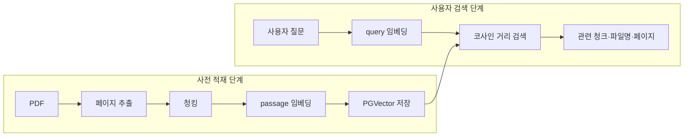

# PDF 가이드 적재 파이프라인 개선 보고서

> 이 문서의 2026-08-16 실행 결과는 로컬 E5 기준선 기록이다. 현재 구현은 OpenAI `text-embedding-3-small` 1,536차원으로 전환되었으며, 기존 기준선 컬렉션을 보존하기 위해 `_openai_3_small` 접미사의 새 컬렉션을 사용한다. 새 모델 적재 결과는 재적재 후 별도로 기록해야 한다.

## 목표

`knowledge_base/pdfs/guides`의 PDF 4개를 로딩하고, 검색에 적합한 청크로 나눈 뒤 임베딩하여 PostgreSQL+pgvector 컬렉션에 중복 없이 저장하는 것을 1차 목표로 한다. 이 단계는 전체 RAG의 끝이 아니라 이후 사례·정책 컬렉션, 하이브리드 검색, Corrective RAG로 이어지는 기반이다.

## 먼저 알아야 할 핵심 개념

### 임베딩과 벡터란 무엇인가

LLM이나 검색 모델은 문장의 의미를 사람이 읽는 문자열 그대로 비교하지 않는다. 임베딩 모델은 문장이나 문서 청크를 여러 개의 숫자로 이루어진 벡터로 변환한다.

예를 들어 실제 값은 아니지만 다음과 같이 생각할 수 있다.

```text
"전세계약 전에 집주인을 확인하는 방법"
→ [0.12, -0.38, 0.71, ...]

"임대차계약 시 소유자와 계약 상대방 확인"
→ [0.10, -0.35, 0.69, ...]

"청년 식비 절약 방법"
→ [-0.42, 0.18, 0.05, ...]
```

첫 번째 문장과 두 번째 문장은 사용하는 단어가 완전히 같지 않지만 의미가 비슷하므로 벡터 공간에서도 가까운 위치에 놓이도록 학습된다. 세 번째 문장은 다른 주제이므로 상대적으로 먼 위치에 놓인다.

현재 프로젝트에서 사용하는 OpenAI `text-embedding-3-small`은 하나의 문서 청크나 검색 질문을 1,536개의 실수로 변환한다. 따라서 Elasticsearch가 실제 단어의 포함 여부를 중심으로 찾는다면, 임베딩 검색은 문장 전체의 의미가 얼마나 가까운지를 중심으로 찾는다.

### PGVector란 무엇인가

PGVector는 PostgreSQL에서 벡터를 저장하고 벡터 사이의 거리를 계산할 수 있게 해주는 확장 기능이다. PostgreSQL 자체는 문자열, 숫자, 날짜와 같은 일반적인 데이터를 저장하는 관계형 데이터베이스다. PGVector 확장을 추가하면 일반 데이터와 함께 임베딩 벡터를 저장하고, 입력 질의와 가까운 벡터를 데이터베이스 안에서 검색할 수 있다.

이 프로젝트에서 PGVector는 별도의 독립 프로그램이 아니라 Docker로 실행되는 PostgreSQL 16 안에서 동작한다.

```text
PostgreSQL
├─ LangChain 컬렉션 정보
├─ PDF 청크 본문
├─ 파일명·페이지·문서 해시 메타데이터
└─ PGVector가 처리하는 1,536차원 임베딩 벡터
```

LangChain의 `langchain-postgres`가 다음 두 테이블을 관리한다.

| 테이블 | 역할 |
|---|---|
| `langchain_pg_collection` | guides, cases, policies 컬렉션 이름과 UUID 관리 |
| `langchain_pg_embedding` | 청크 본문, JSONB 메타데이터와 임베딩 벡터 저장 |

따라서 검색 결과는 벡터만 반환하는 것이 아니다. 가까운 벡터와 연결된 원문 청크, PDF 파일명, 페이지 번호도 함께 반환한다. 이를 이용해 LLM에 실제 문서 근거를 전달하고 보고서에 출처를 표시할 수 있다.

### 벡터 유사도 검색이란 무엇인가

벡터 유사도 검색은 사용자의 질문을 문서와 같은 임베딩 모델로 벡터화한 뒤, 저장된 문서 벡터 중 질문 벡터와 가장 가까운 것을 찾는 방식이다.

```text
사용자 질문
→ query 임베딩 생성
→ PGVector에 저장된 문서 임베딩과 거리 계산
→ 거리가 가까운 청크를 Top-K로 반환
```

이 프로젝트에서는 코사인 방식을 사용한다. 코사인 유사도는 두 벡터의 절대 크기보다 방향이 얼마나 비슷한지를 측정한다.

```text
cosine similarity = (질의 벡터 · 문서 벡터)
                    ──────────────────────
                    |질의 벡터| × |문서 벡터|
```

두 벡터의 방향이 같을수록 코사인 유사도는 높아진다. 이 프로젝트의 문서와 질의 벡터는 미리 정규화하므로 벡터 크기의 영향을 줄이고 의미 방향을 비교한다.

현재 LangChain PGVector 검색 결과에서는 코사인 **거리**가 함께 반환된다. 일반적으로 코사인 유사도가 높을수록 관련성이 높지만 코사인 거리는 반대로 **낮을수록 관련성이 높다**.

```text
distance=0.12 → 질문과 매우 가까운 결과
distance=0.37 → 상대적으로 덜 가까운 결과
distance=0.81 → 관련성이 낮을 가능성이 큰 결과
```

거리값 자체만으로 정답 여부를 확정할 수는 없다. 질문의 난이도, 문서 구성과 코퍼스에 따라 거리 분포가 달라지므로 같은 검색의 후보 순위를 정하는 값으로 사용하고, 실제 원문 내용과 평가 지표를 함께 확인해야 한다.

### E5 모델에서 문서와 질문을 구분하는 이유

현재 임베딩 모델은 E5 계열이다. E5는 검색할 문서와 사용자의 질의에 서로 다른 접두어를 붙이는 방식으로 학습됐다.

```text
PDF 청크 입력: passage: 임대차계약을 체결하기 전에...
사용자 질문 입력: query: 전세계약 전에 무엇을 확인해야 하나요?
```

코드에서는 문서 임베딩에 `passage: `, 검색어 임베딩에 `query: `를 자동으로 붙인다. 이 구분을 생략하거나 반대로 사용하면 같은 모델을 사용하더라도 검색 품질이 낮아질 수 있다.

### 이 프로젝트에서 PGVector를 사용하는 이유

자취 독립을 준비하는 사용자는 문서의 정확한 표현을 모르는 경우가 많다. 예를 들어 사용자는 `집주인이 진짜 주인인지 어떻게 알아보나`라고 입력할 수 있지만 공식 안내서에는 `등기사항증명서상의 소유자와 계약 상대방의 일치 여부`라고 적혀 있을 수 있다.

단순 키워드 검색은 두 표현에서 공통 단어가 적어 문서를 놓칠 수 있다. 벡터 검색은 표현이 달라도 의미가 유사한 청크를 찾을 수 있으므로 자연어로 상황을 설명하는 일반 사용자 입력에 적합하다.

반대로 정확한 정책명, 지역명, 금액과 계약 용어는 키워드 검색이 더 잘 찾을 수 있다. 그래서 현재 프로젝트는 PGVector를 의미 검색의 기반으로 유지하고, Elasticsearch BM25를 정확한 표현 검색에 추가한 뒤 다음 단계에서 두 순위를 결합하려 한다.

### 적재와 검색은 서로 다른 시점에 실행된다

PGVector 파이프라인은 적재 단계와 검색 단계로 나뉜다.



PDF는 사용자가 질문할 때마다 다시 임베딩하지 않는다. PDF가 추가되거나 변경될 때 사전에 적재하고, 실제 검색 시에는 사용자의 질문만 한 번 임베딩해 이미 저장된 문서 벡터와 비교한다.

## 기존 파이프라인

```text
이사 안내 PDF 1개
→ PyPDFLoader 전체 로드
→ 200자 고정 청킹
→ Hugging Face 임베딩 모델 초기화
→ psycopg2로 PostgreSQL 접속
→ vector 확장 생성 시도
→ PGVector.from_documents 호출
```

## 기존 파일의 문제

1. `guides` 폴더 전체가 아니라 `easylaw_moving_guide_2026.pdf` 한 개만 처리했다.
2. `chunk_size=200`은 문맥을 지나치게 잘게 나눠 계약·절차 설명이 분리될 가능성이 컸다.
3. 정규식 형태의 문장 구분자를 넣고 `is_separator_regex=False`로 설정해 문장 구분 정규식이 작동하지 않았다.
4. 분할 결과 변수는 `docs_with_splitter`인데 적재 단계에서는 정의되지 않은 `splits`를 사용했다.
5. 임베딩 모델, DB 주소, 컬렉션 이름, 청크 크기 등이 코드에 고정돼 있었다.
6. DB 연결을 두 번 만들고 첫 연결을 닫지 않았다.
7. PostgreSQL이 실행 중인지 확인하기 전에 큰 임베딩 모델을 먼저 초기화해 실패를 늦게 발견했다.
8. 재실행 시 동일 문서가 중복 적재될 수 있었다.
9. 파일·페이지·청크를 추적할 안정적인 ID와 문서 해시가 없었다.
10. DB에 실제로 몇 개가 저장됐는지 검증하지 않았다.

## 개선된 파이프라인

```text
환경설정 검증
→ guides/*.pdf 4개 자동 탐색
→ PDF별 lazy page 로딩
→ 빈 페이지 제외
→ 출처·페이지·문서 SHA-256 메타데이터 추가
→ 800자/120자 중첩의 한국어 친화 청킹
→ 결정적 chunk_id 생성
→ PGVector 저장 ID를 collection_name:chunk_id로 네임스페이스화
→ PostgreSQL 연결을 5초 안에 사전 확인
→ 경량 다국어 E5 임베딩 모델 8개 단위 배치 처리
→ guides 전용 PGVector 컬렉션 재구축
→ 생성 청크 수와 DB 행 수 비교 검증
```

## 생성·변경한 파일

| 파일 | 역할 |
|---|---|
| `src/config.py` | 환경변수와 경로, 청킹·DB 설정 관리 |
| `src/ingestion/pdf_pipeline.py` | PDF 탐색, 페이지 로딩, 메타데이터, 청킹, ID 생성 |
| `src/common/embedding_factory.py` | Hugging Face 임베딩 모델과 배치 설정 |
| `src/common/vector_store.py` | DB 사전 확인, PGVector 적재, 저장 건수 검증 |
| `src/ingestion/ingest.py` | 전체 적재 흐름을 실행하는 CLI 진입점 |
| `src/retrieval/search.py` | 기존 컬렉션을 보존한 채 유사도 검색을 시험하는 CLI |
| `compose.yaml` | PostgreSQL 16과 pgvector 실행 환경 |
| `.env.example` | 노출 가능한 설정 예시 |

## 실행 방법

프로젝트 루트에서 실행한다.

```powershell
docker compose up -d
.venv\Scripts\python.exe -m src.ingestion.ingest --dry-run
.venv\Scripts\python.exe -m src.ingestion.ingest
.venv\Scripts\python.exe -m src.retrieval.search "전세계약 전에 무엇을 확인해야 하나요?" -k 3
```

`--dry-run`은 PDF 로딩과 청킹까지만 검사하므로 모델 다운로드나 DB가 필요하지 않다.

## 실제 실행 결과

2026-08-16에 로컬 Windows CPU와 Docker의 `pgvector/pgvector:pg16` 환경에서 확인했다.

- Docker 컨테이너 상태: `healthy`
- 발견한 PDF: 4개
- 텍스트가 추출된 페이지: 128개
- 생성 및 저장한 청크: 272개
- 컬렉션: `youth_independence_guides`
- 임베딩 모델: `intfloat/multilingual-e5-small` (384차원, 정규화)
- 최초 전체 적재 시간: 148.3초(모델 다운로드 시간 제외 재실행 기준)
- 검증 결과: 생성 청크 수 272개와 DB 저장 행 272개가 일치

문서별 적재 건수는 다음과 같다.

| 원본 PDF | 저장 청크 |
|---|---:|
| `easylaw_moving_guide_2026.pdf` | 10 |
| `financial_life_guide_young_adults_2026.pdf` | 106 |
| `housing_lease_protection_guide_2020.pdf` | 137 |
| `standard_housing_lease_contract_2023.pdf` | 19 |

`전세계약 전에 등기부와 보증금을 어떻게 확인해야 하나요?`라는 질의로 검색했을 때 표준 주택임대차계약서 4페이지와 주택임대차보호법 해설집 44페이지가 상위 3개 결과로 반환됐다. 따라서 PDF 탐색부터 임베딩, pgvector 적재, 질의 임베딩, 코사인 유사도 검색까지의 왕복 경로가 동작한다.

## 실행 중 발견해 추가로 개선한 병목

초기 기본 모델인 `Qwen/Qwen3-Embedding-0.6B`는 이 PC에서 가중치를 CPU 메모리에 올리는 중 메모리 부족으로 실패했다. 4개 가이드 문서와 일반 사용자용 한국어 검색이라는 현재 범위에는 모델 크기가 과도하므로 `intfloat/multilingual-e5-small`로 변경했다. 문서 임베딩에는 `passage: `, 사용자 질의에는 `query: ` 접두어를 각각 적용해 E5 모델의 권장 검색 방식을 지켰다.

또한 `langchain-huggingface`가 `show_progress_bar`를 내부 전달하는데 같은 값을 `encode_kwargs`에도 넣으면 중복 인자 오류가 발생했다. 진행 표시 설정은 래퍼의 `show_progress=True` 한 곳으로 이동했다. 최종 배치 크기는 메모리 안정성을 위해 8로 설정했다.

## 다음 확장 단계

1. `cases`, `policies`를 각각 별도 컬렉션으로 적재한다.
2. Vector 검색과 BM25를 결합한다.
3. 검색 결과에 reranker를 적용한다.
4. 사용자 입력을 사례·실행지식·정책 질의로 분해한다.
5. 근거가 부족한 영역만 재검색하는 Corrective RAG를 연결한다.
6. 검색 평가 세트와 구조화 리포트 생성기를 추가한다.
