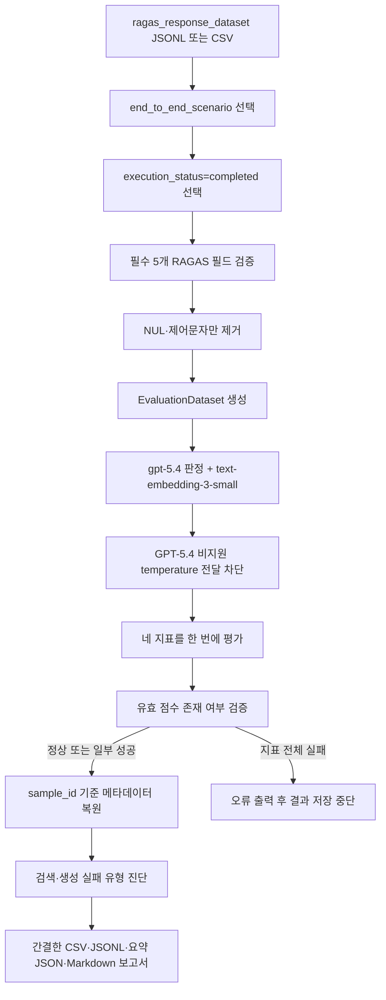

# RAGAS 평가 실행 파이프라인 설명서

## 1. 문서 목적

이 문서는 `test_dataset.py`와 `response_dataset.py`가 만든 데이터를 `ragas.py`가 어떻게 평가하는지 설명한다. 기존 실습 코드의 문제, 입력 검증과 최소 전처리, 네 가지 RAGAS 지표, 평가 모델 선택, 결과 분석과 저장 구조를 현재 프로젝트 코드 기준으로 정리한다.

## 2. 세 파일의 관계

```text
test_dataset.py
  -> 사용자 상황, 기준 답변, 기준 문맥 생성
  -> ragas_test_dataset.jsonl

response_dataset.py
  -> 실제 PGVector + Elasticsearch + Weighted RRF 검색
  -> 실제 gpt-5.4-mini 보고서 생성
  -> ragas_response_dataset.jsonl

ragas.py
  -> 완료된 응답 행 검증
  -> 네 가지 RAGAS 지표 계산
  -> 상세 점수, 요약 JSON, 분석 보고서 저장
```

`ragas.py`는 보고서를 다시 생성하지 않는다. 이미 저장된 실제 RAG 응답과 검색 문맥을 평가만 한다.

## 3. 기존 `ragas.py`의 문제

기존 파일은 노트북 셀을 순서대로 실행하는 실습 코드였으며 다음 문제가 있었다.

- 실제 출력 경로가 아닌 `./data/evaluation_answers_from_rag.csv`를 고정해서 읽었다.
- CSV만 지원했고 JSONL의 목록과 구조화 필드를 직접 사용할 수 없었다.
- `execution_status=failed`인 행을 걸러내지 않았다.
- 특수문자를 광범위하게 제거해 금액, 퍼센트, 면적, Markdown 구조와 정책 문구가 손상될 수 있었다.
- 네 지표를 각각 `evaluate()`로 실행해 초기화와 API 호출 관리가 분산되었다.
- 결과를 `user_input`으로 병합해 같은 입력 문장이 있으면 행이 중복될 가능성이 있었다.
- 평가 모델이 오래된 `gpt-4o-mini`로 고정되어 실제 GPT-5 계열 보고서의 긴 판단과 근거 관계를 판정하기에 부족할 수 있었다.
- 평균과 낮은 점수 사례는 계산했지만 실행 설정, 결측 점수, 모델과 입력 파일 정보가 결과에 남지 않았다.
- 최종 결과가 CSV 한 개뿐이어서 목록 형태 문맥과 실행 메타데이터를 보존하기 어려웠다.

## 4. 개선된 평가 흐름



## 5. 입력 조건

평가에는 `response_dataset.py`가 생성한 JSONL 또는 CSV를 사용한다. 다음 조건을 모두 만족하는 행만 평가한다.

- `dataset_role`이 `end_to_end_scenario`다.
- `execution_status`가 `completed`다.
- `sample_id`가 존재하며 중복되지 않는다.
- `user_input`, `response`, `reference`가 비어 있지 않다.
- `retrieved_contexts`, `reference_contexts`가 문자열을 가진 목록이다.

RAGAS에 전달하는 핵심 필드는 다음과 같다.

| 필드 | 평가에서의 역할 |
|---|---|
| `user_input` | 사용자의 구조화 상황을 자연어로 표현한 요청 |
| `retrieved_contexts` | 실제 Hybrid 검색이 가져온 문맥 |
| `response` | 실제 생성된 제목과 보고서 본문 |
| `reference` | 사람이 정의한 기대 판단과 필수 내용 |
| `reference_contexts` | 기준 답변을 뒷받침하는 원본 PDF 문맥 |

## 6. 텍스트 전처리 원칙

기존 코드처럼 특정 특수문자나 한글·영문 외 문자를 모두 삭제하지 않는다. 이 프로젝트에서는 다음 기호가 의미를 가질 수 있기 때문이다.

- 원화 금액과 쉼표
- 퍼센트
- 제곱미터와 면적 표현
- 하이픈과 정책명
- Markdown 소제목
- 계약 조항의 괄호와 문장부호

기본 전처리는 NUL 문자와 표시 불가능한 제어문자만 제거한다. `--normalize-whitespace`를 사용했을 때만 줄바꿈과 연속 공백을 하나의 공백으로 합친다. 이 경우에도 금액과 기호는 보존한다.

## 7. 평가 지표

### 7.1 Answer Relevancy

보고서가 사용자 상황과 요청에 얼마나 직접적으로 답하는지 평가한다. 사실의 진위보다 입력 의도와 응답 내용의 관련성을 본다. 기본 `strictness=3`을 사용한다.

### 7.2 Faithfulness

보고서의 주장들이 실제 `retrieved_contexts`로 뒷받침되는지 평가한다. 낮으면 검색되지 않은 정책 조건, 금액이나 절차를 생성했을 가능성을 먼저 확인한다.

### 7.3 Context Recall

기준 답변의 주요 내용이 실제 검색 문맥에 얼마나 포함되었는지 평가한다. 낮으면 필요한 가이드·사례·정책 근거를 검색 단계에서 놓쳤을 가능성이 있다.

### 7.4 Context Precision

실제 검색 문맥 중 기준 답변과 관련된 문맥이 얼마나 앞쪽에 배치되었는지 평가한다. 현재 코드는 `LLMContextPrecisionWithReference`의 출력명을 `context_precision`으로 지정한다.

네 지표는 별도 네 번이 아니라 하나의 `evaluate()` 호출에서 함께 계산한다.

## 8. 모델 선택

| 역할 | 기본 모델 | 선택 이유 |
|---|---|---|
| 실제 보고서 생성 | `gpt-5.4-mini` | 실제 서비스 설정과 동일한 응답을 평가하기 위해 고정 |
| RAGAS LLM 판정 | `gpt-5.4` | 생성 모델보다 강한 별도 모델로 긴 보고서의 주장과 근거 관계 판정 |
| Answer Relevancy 임베딩 | `text-embedding-3-small` | 실제 프로젝트와 같은 한국어 임베딩 계열 유지 |

평가 모델을 생성 모델과 분리하면 같은 모델이 자신의 출력 특성을 선호하는 영향을 줄일 수 있다. `gpt-5.4`는 기본 reasoning effort `low`로 사용하여 판정 품질과 비용을 조절한다.

RAGAS 0.3.9는 내부 프롬프트에 따라 `temperature=0.3` 등을 전달한다. 그러나 `gpt-5.4` Chat Completions 호출은 이 값을 허용하지 않고 기본 temperature만 지원한다. 현재 구현은 `LangchainLLMWrapper(bypass_temperature=True)`를 사용해 RAGAS가 temperature를 덮어쓰지 못하게 한다. Answer Relevancy의 임베딩은 `langchain_openai.OpenAIEmbeddings`를 `LangchainEmbeddingsWrapper`로 감싸 `embed_query()` 인터페이스를 맞춘다.

환경변수는 다음과 같다.

```text
RAGAS_TESTSET_MODEL=gpt-5.4-mini
RAGAS_JUDGE_MODEL=gpt-5.4
RAGAS_JUDGE_REASONING_EFFORT=low
RAGAS_EVALUATOR_EMBEDDING_MODEL=text-embedding-3-small
```

OpenAI 모델 문서: <https://developers.openai.com/api/docs/models/gpt-5.4-mini>

## 9. 실행 안정성 설정

기본 실행값은 다음과 같다.

| 옵션 | 기본값 | 의미 |
|---|---:|---|
| `--timeout` | 180초 | 개별 평가 작업 제한 시간 |
| `--max-retries` | 2 | 일시적인 API 실패 재시도 |
| `--max-workers` | 4 | 동시 평가 작업 수 |
| `--low-score-threshold` | 0.7 | 낮은 점수 분류 기준 |
| 평가 예외 | 즉시 중단 | API·파싱 오류를 숨기지 않고 실제 원인을 출력 |
| `--continue-on-error` | 미사용 | 일부 지표 실패를 NaN으로 남기고 나머지 계속 실행 |

RAGAS 기본 동시 작업 수보다 낮은 4를 사용해 작은 프로젝트의 API 사용량 급증과 rate limit 위험을 줄인다.

`--continue-on-error`를 사용하더라도 특정 지표의 유효 점수가 전체 문항에서 0개라면 정상 평가가 아니다. 이 경우 코드가 최종 보고서와 점수 파일 생성을 중단한다. 일부 문항만 실패한 경우에만 `evaluation_status=partial`로 저장한다.

## 10. 실행 방법

모든 명령은 `D:\RAG-personal-project`에서 실행한다.

### 10.1 입력만 검증

OpenAI와 RAGAS 평가를 호출하지 않는다.

```powershell
.\.venv\Scripts\python.exe -m src.ragas.ragas `
  --input evaluation\ragas\ragas_response_dataset.jsonl `
  --validate-only
```

### 10.2 한 건만 비용 시험

```powershell
.\.venv\Scripts\python.exe -m src.ragas.ragas `
  --input evaluation\ragas\ragas_response_dataset.jsonl `
  --limit 1
```

### 10.3 전체 완료 행 평가

```powershell
.\.venv\Scripts\python.exe -m src.ragas.ragas `
  --input evaluation\ragas\ragas_response_dataset.jsonl
```

### 10.4 평가 모델과 동시 작업 수 변경

```powershell
.\.venv\Scripts\python.exe -m src.ragas.ragas `
  --input evaluation\ragas\ragas_response_dataset.jsonl `
  --judge-model gpt-5.4 `
  --reasoning-effort low `
  --max-workers 2
```

## 11. 결과 파일

`--output-dir`을 생략하면 실행 시각을 이용해 새 디렉터리를 만든다.

```text
evaluation/ragas/results/YYYYMMDD_HHMMSS/
├── ragas_scores.csv
├── ragas_scores.jsonl
├── ragas_summary.json
└── ragas_evaluation_report.md
```

| 파일 | 용도 |
|---|---|
| `ragas_scores.csv` | 지표, 진단과 추적용 개수만 담은 간결한 표 |
| `ragas_scores.jsonl` | CSV와 같은 간결한 점수를 기계 판독 형태로 저장 |
| `ragas_summary.json` | 모델, 입력, 실행 설정과 지표 통계의 기계 판독 |
| `ragas_evaluation_report.md` | 지표 평균과 낮은 점수 사례를 사람이 검토 |

결과 디렉터리를 직접 지정했는데 이미 파일이 있으면 기존 결과를 덮어쓰지 않고 중단한다.

긴 `user_input`, 생성 보고서, `retrieved_contexts`, `reference_contexts`는 원본 `ragas_response_dataset.jsonl`에 이미 있으므로 점수 파일에 다시 복제하지 않는다. 점수와 원문은 `sample_id`로 연결한다.

### 11.1 실행 중 확인되는 콘솔 정보

실행 시 입력 행·열 수, 평가에서 제외된 실패 행, 생성·판정·임베딩 모델과 첫 평가 문항의 입력·기준 답변 미리보기를 먼저 보여준다. 평가가 끝나면 각 지표의 평균·중앙값·최솟값·최댓값·성공 및 실패 수를 출력한다. 낮은 점수나 NaN이 있는 사례는 `sample_id`, 최저 점수와 검색·생성 진단을 한 줄씩 출력한다. 이는 기존 실습 코드가 지표별 결과와 낮은 점수 행을 화면에서 확인하려던 의도를 유지하면서도 전체 보고서와 문맥이 콘솔을 과도하게 차지하지 않게 정리한 방식이다.

## 12. 결과 병합 방식

RAGAS `EvaluationDataset`에는 프로젝트의 `sample_id`와 `evaluation_focus`가 포함되지 않는다. 평가 후 결과 행의 원래 순서를 이용해 이 메타데이터를 복원한다.

기존처럼 `user_input` 문자열로 병합하지 않으므로 같은 문장의 사용자 입력이 여러 개 있어도 점수 행이 늘어나거나 잘못 연결되지 않는다.

## 13. 낮은 점수 진단

각 행의 네 지표 중 최솟값이 기준보다 낮으면 다음 방식으로 분류한다.

| 조건 | 진단 |
|---|---|
| Context Recall 또는 Precision만 낮음 | 검색 단계 우선 점검 |
| Answer Relevancy 또는 Faithfulness만 낮음 | 생성 단계 우선 점검 |
| 두 영역 모두 낮음 | 검색과 생성 모두 점검 |
| 하나 이상의 지표가 NaN | 평가 호출 오류 또는 결측 점수 확인 |
| 모두 기준 이상 | 기준 이상 |

NaN은 품질 점수가 0이라는 의미가 아니다. 해당 지표의 모델 호출, 파싱이나 API 요청이 실패했다는 의미이므로 재실행과 오류 확인이 먼저다.

## 14. 오류 분석 및 검증 결과

최초 전체 실행은 네 지표가 모두 NaN이었지만 `raise_exceptions=False` 때문에 최종 보고서가 잘못 생성되었다. 예외를 표시해 재현한 결과 다음 두 호환 문제가 순서대로 확인되었다.

1. RAGAS가 전달한 `temperature=0.3`을 `gpt-5.4`가 지원하지 않아 HTTP 400이 발생했다.
2. RAGAS의 새 OpenAI 임베딩 객체에는 Answer Relevancy가 기대한 `embed_query()`가 없어 `AttributeError`가 발생했다.

두 문제를 수정한 뒤 첫 번째 시나리오 1건을 실제 OpenAI API로 다시 평가했으며 네 지표 모두 유효한 숫자가 생성되었다. 단위 테스트에서는 특수문자 보존, 실패 행 제외, 검색·생성 진단, 전 지표 NaN 저장 차단과 점수 파일의 원문 제외를 확인했다.

## 15. 현재 한계

- RAGAS LLM 지표는 판정 모델의 판단에 영향을 받으므로 절대적인 정답이 아니다.
- 현재 수동 종단 간 사례는 5개로 표본이 작다.
- 긴 보고서는 여러 주장으로 분해되므로 Faithfulness 평가 호출 비용이 커질 수 있다.
- 기준 답변은 완성 문장 정답보다 평가 요구사항에 가까워 일부 지표가 실제 체감 품질과 다르게 반응할 수 있다.
- 자동 지표만으로 정책의 법적 정확성, 최신성, 문체와 실제 유용성을 완전히 평가할 수 없다.

## 16. 다음 단계

먼저 응답 데이터셋 한 건에 `--limit 1`을 적용해 비용과 실행 시간을 확인한다. 결과가 정상적이면 전체 5개 사례를 평가하고, 가장 낮은 `sample_id`부터 `retrieved_evidence`, 실제 보고서와 기준 문맥을 함께 읽어 검색 문제와 생성 문제를 분리해서 개선한다.
