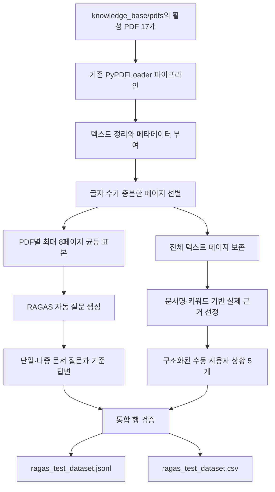

# RAGAS 평가 데이터셋 생성 파이프라인 설명서

## 1. 문서 목적

이 문서는 청년 자취 독립 플래너 RAG 프로젝트에서 RAGAS 평가에 사용할 테스트 데이터셋과 응답 데이터셋을 어떻게 생성하는지 설명한다. RAGAS의 역할, 기존 `test_dataset.py`와 `response_dataset.py`의 문제, 개선된 문서 입력과 질문 생성 방식, 실제 서비스 입력을 반영한 수동 평가 사례, 실제 Hybrid RAG 실행 결과의 저장 구조와 실행 방법을 코드 기준으로 정리한다.

평가 점수를 계산하는 코드는 아직 이 단계의 범위가 아니다. 현재 단계의 결과물은 평가 기준을 담은 테스트 데이터셋과 실제 검색 문맥·보고서를 담은 응답 데이터셋이다.

## 2. RAGAS란 무엇인가

RAGAS는 RAG 시스템의 검색 결과와 생성 답변을 평가하기 위한 프레임워크다. 일반적인 정답 문자열 일치만 보는 대신 사용자 입력, 검색된 문맥, 실제 답변과 기준 답변의 관계를 이용해 RAG의 각 단계를 나누어 평가할 수 있다.

대표적으로 다음과 같은 질문에 답하는 데 사용할 수 있다.

- 검색된 문맥이 사용자 입력과 실제로 관련 있는가
- 필요한 근거가 검색 결과에 충분히 포함되었는가
- 생성 답변의 주장이 검색 문맥에 근거하는가
- 생성 답변이 사용자 요구에 적절하게 대응하는가
- 기준 답변의 핵심 내용을 실제 답변이 얼마나 충족하는가

RAGAS 평가에는 평가 대상 시스템의 실행 결과뿐 아니라 평가 기준이 되는 데이터가 필요하다. 현재 만드는 테스트 데이터셋은 이 기준 데이터를 준비하는 단계다.

## 3. 이 프로젝트에서 평가해야 하는 대상

현재 시스템은 단순한 문서 질의응답기가 아니다. 사용자가 화면에서 선택하거나 직접 입력한 구조화된 상황을 바탕으로 PGVector와 Elasticsearch를 검색하고, 결합된 근거를 이용해 개인 맞춤형 자취 독립 보고서를 생성한다.

따라서 평가 데이터셋도 다음 두 영역을 모두 다뤄야 한다.

1. 문서 검색과 근거 활용 능력
2. 구조화된 개인 상황을 보고서 판단과 행동 계획에 반영하는 능력

문서에서 자동 생성한 일반 질문만 사용하면 첫 번째 영역은 평가할 수 있지만 실제 서비스 입력과 보고서 개인화는 충분히 평가하기 어렵다. 반대로 사람이 만든 상황 사례만 사용하면 다양한 문서 내용을 폭넓게 시험하기 어렵다. 이 문제를 해결하기 위해 자동 생성 질문과 수동 구조화 사례를 하나의 데이터셋에 함께 넣는다.

## 4. 기존 `test_dataset.py`의 문제

기존 파일은 RAGAS 사용 예제를 수정한 실습 코드에 가까웠으며 현재 프로젝트와 다음 부분이 맞지 않았다.

### 4.1 잘못된 문서 입력

기존 코드는 다음 경로의 AI 동향 PDF 한 개만 사용하도록 작성되어 있었다.

```text
./data/SPRI_AI_Brief_2023년12월호_F.pdf
```

현재 프로젝트의 실제 지식베이스인 자취 안내서, 청년 경험 사례와 지원정책 공고는 사용하지 않았다.

### 4.2 프로젝트와 무관한 페르소나

기존 페르소나는 `AI Specialist`와 `AI Policy Analyst`였다. 생성되는 질문도 AI 규제, 국제 행동강령과 AI 안전성처럼 청년 독립 보고서와 관계없는 내용이었다.

### 4.3 실제 입력 스키마 미반영

현재 시스템의 입력에는 나이, 고용·학업 상태, 현재 지역, 목표 지역, 소득, 보유자금, 이동 시기, 선호 주거 형태와 우선순위 등이 포함된다. 기존 데이터셋은 일반 문장형 질문만 생성하므로 이러한 구조화 입력을 처리하는 실제 파이프라인을 평가할 수 없었다.

### 4.4 실행 구조 문제

기존 파일에는 함수 밖의 최상위 `await`가 있었다. 일반적인 Python 모듈로 실행하면 문법 오류가 발생할 수 있는 구조였다. 경로와 데이터셋 크기도 코드에 고정되어 있었으며 출력 디렉터리를 자동으로 생성하지 않았다.

### 4.5 불안정한 문서 인덱스 참조

수동 평가 사례에서 `documents[0]`, `documents[5]`처럼 목록 순번으로 문맥을 지정했다. PDF 또는 페이지 순서가 달라지면 전혀 다른 문맥이 정답 근거로 연결될 수 있었다.

## 5. 개선된 전체 흐름



자동 생성과 수동 사례는 동일한 문서 원본을 사용하지만 페이지 사용 방식이 다르다. 자동 생성은 API 비용과 처리 시간을 제한하기 위해 PDF별 최대 페이지 수를 적용한다. 수동 사례의 기준 문맥은 중요한 근거가 표본에서 빠지는 것을 막기 위해 전체 텍스트 페이지에서 찾는다.

## 6. 입력 문서

데이터셋 생성기는 `src.config.CORPUS_NAMES`와 `get_corpus_config()`를 사용한다. 따라서 별도의 평가용 경로를 다시 정의하지 않고 실제 적재 파이프라인과 같은 활성 PDF 디렉터리를 읽는다.

| 코퍼스 | 문서 역할 | 활성 PDF 수 |
|---|---|---:|
| `guides` | 임대차계약, 이사, 금융생활 등 실행 지식 | 4 |
| `cases` | 청년 주거 이동, 1인 가구 생활비와 위험, 정책 접근 경험 | 6 |
| `policies` | 서울시·LH·한국장학재단 지원정책 공고와 안내 | 7 |
| 합계 |  | 17 |

PDF 로딩에는 실제 적재 단계에서 사용하는 `discover_pdfs()`와 `load_pdf_pages()`를 그대로 사용한다. 이에 따라 각 페이지에는 다음 메타데이터가 포함된다.

- `corpus`
- `source_file`
- `page_number`
- `document_title`
- `policy_name`
- `search_keywords`
- `document_sha256`

## 7. 텍스트 페이지 선별

기본적으로 정규화한 본문이 250자 이상인 페이지만 자동 질문 생성 자료로 사용한다. 그림이나 표지만 존재하는 페이지와 텍스트가 지나치게 적은 페이지가 질문 생성에 포함되는 것을 줄이기 위한 기준이다.

문서 앞부분만 선택하면 표지와 목차에 편중될 수 있으므로 한 PDF의 사용 가능한 전체 페이지 범위에서 균등한 간격으로 페이지를 고른다. 기본 상한은 PDF당 8페이지다.

이 값은 실행 옵션으로 조정할 수 있다.

```powershell
--max-pages-per-pdf 8
--min-page-chars 250
```

페이지 상한을 높이면 문서 내용의 범위는 넓어지지만 지식 그래프 변환, LLM 호출과 임베딩 비용도 증가한다.

## 8. RAGAS 자동 생성 데이터

자동 생성 데이터는 문서에 포함된 개별 사실과 여러 문서의 관계를 폭넓게 시험하기 위한 `document_grounding_probe` 역할을 가진다.

### 8.1 생성 모델과 임베딩

기본값은 다음과 같다.

| 용도 | 기본 모델 |
|---|---|
| 질문·기준 답변 생성 | `gpt-5.4-mini` |
| 지식 그래프 구성용 임베딩 | `text-embedding-3-small` |

모델은 각각 `--generator-model`과 `--embedding-model` 옵션 또는 환경변수로 변경할 수 있다. OpenAI 호출에는 `.env`의 `OPENAI_API_KEY`가 필요하다.

### 8.2 프로젝트 페르소나

자동 질문은 다음 세 관점에서 생성한다.

1. 첫 자취를 준비하는 취업 청년
2. 소득이 불안정한 구직자·학생
3. 청년 주거·정책 상담자

페르소나는 계약 방법, 이사 순서, 비용 위험, 실제 청년의 선택과 정책 자격을 묻는 질문이 생성되도록 정의되어 있다.

### 8.3 질문 유형 분포

| 질문 유형 | 비율 | 목적 |
|---|---:|---|
| 단일 문서 구체 질문 | 35% | 하나의 안내서나 공고에서 정확한 근거를 찾는지 확인 |
| 다중 문서 구체 질문 | 40% | 계약·사례·정책 등 여러 문맥을 결합하는지 확인 |
| 다중 문서 추상 질문 | 25% | 여러 사례와 지침에서 공통된 의미를 종합하는지 확인 |

현재 보고서는 가이드, 실제 사례와 정책을 함께 활용해야 하므로 RAGAS 기본 분포보다 구체적인 다중 문서 질문의 비중을 높였다.

생성기의 질문 프롬프트는 `adapt_prompts("korean")`을 통해 한국어로 변환한다. 기존 최상위 `await`는 비동기 함수와 `asyncio.run()` 구조로 변경했다.

## 9. 수동 종단 간 평가 사례

수동 데이터는 실제 `UserSituation` 스키마를 그대로 통과하는 `end_to_end_scenario` 역할을 가진다. 각 사례는 `RagRequest`로 검증되기 때문에 실제 시스템이 받을 수 없는 필드 구성은 데이터셋에 저장되지 않는다.

| 사례 ID | 상황 | 핵심 평가 목적 |
|---|---|---|
| `scenario_employed_suwon_to_seoul` | 수원에서 서울로 통근 목적 이사 | 개인화, 계약·이사 순서, 서울 정책 근거성 |
| `scenario_jobseeker_low_cash_urgent_move` | 소득 없이 한 달 안에 서울 이동 희망 | 연기·조건 조정 판단, 숫자·정책 환각 방지 |
| `scenario_graduate_student_to_seoul` | 대학원 진학과 소득 감소 가능성 | 학생 정책 자격, 외곽 주거 대안 비교 |
| `scenario_incomplete_cost_inputs` | 아직 매물을 보지 않아 비용 미입력 | 결측값 처리, 임의 금액 생성 방지 |
| `scenario_non_seoul_policy_coverage` | 창원에서 부산으로 취업 이동 | 서울 정책의 지역 오적용 방지 |

수동 사례의 `reference`는 정답 보고서 전체를 고정한 것이 아니라 반드시 포함하거나 피해야 할 판단 기준을 서술한다. 보고서 문장은 매번 달라질 수 있으므로 한 가지 문구와 일치하는지를 평가하기보다 핵심 판단, 실행 순서, 근거성과 환각 방지를 평가하기 위한 방식이다.

## 10. 수동 근거 문맥 선택 방식

기존처럼 페이지 배열의 순번을 사용하지 않는다. `_find_contexts()`가 다음 조건으로 실제 페이지를 선택한다.

1. 사례에 필요한 PDF 파일명을 명시한다.
2. 계약, 보증금, 주거비, 통근, 월세지원 등 사례별 핵심 키워드를 지정한다.
3. 지정한 문서 안에서 키워드 출현 수와 본문 길이를 기준으로 페이지를 정렬한다.
4. 상위 페이지 본문을 `reference_contexts`에 저장한다.

따라서 다른 PDF가 추가되어 전체 로딩 순서가 바뀌더라도 수동 사례가 엉뚱한 문서 페이지를 참조하지 않는다.

## 11. 출력 필드

JSONL 한 줄은 평가 문항 하나를 의미한다. 자동 생성 행과 수동 행은 공통 필드를 사용하며 일부 필드는 역할에 따라 `null`일 수 있다.

| 필드 | 의미 |
|---|---|
| `sample_id` | 평가 문항 고유 ID |
| `dataset_role` | `document_grounding_probe` 또는 `end_to_end_scenario` |
| `query_category` | 단일·다중 문서 질문 또는 구조화 상황 분류 |
| `persona_name` | 질문을 생성하거나 상황을 대표하는 페르소나 |
| `user_input` | RAGAS가 평가할 사용자 입력의 문장 표현 |
| `reference` | 기대 답변 또는 반드시 충족할 판단 기준 |
| `reference_contexts` | 기준 답변을 뒷받침하는 원본 PDF 문맥 |
| `situation_json` | 실제 `UserSituation` 입력. 자동 질문은 `null` |
| `evaluation_focus` | 해당 문항에서 집중해 볼 실패 유형 |
| `synthesizer_name` | RAGAS 합성기 또는 수동 사례 식별값 |

`user_input`은 RAGAS의 일반적인 단일 입력 평가 형식에 맞추기 위해 구조화 상황을 자연어로 표현한 값이다. 실제 파이프라인을 실행할 때는 자연어 문장이 아니라 같은 행의 `situation_json`을 `src.run_rag` 입력으로 사용해야 한다.

## 12. 출력 파일

기본 출력 경로는 다음과 같다.

```text
evaluation/ragas/ragas_test_dataset.jsonl
evaluation/ragas/ragas_test_dataset.csv
```

JSONL은 목록과 구조화 상황을 실제 JSON 자료형으로 보존하므로 이후 자동 평가 코드의 주 입력으로 사용하기 적합하다. CSV는 사람이 표 형태로 문항 분포와 내용을 검토하기 위한 보조 파일이다. CSV에서는 목록과 객체 필드가 JSON 문자열로 저장된다.

API 호출 없이 생성한 수동 검증 파일은 다음과 같다.

```text
evaluation/ragas/ragas_test_dataset_manual.jsonl
evaluation/ragas/ragas_test_dataset_manual.csv
```

## 13. `response_dataset.py`의 역할

`response_dataset.py`는 `test_dataset.py`와 한 쌍으로 동작한다. 테스트 데이터셋의 `end_to_end_scenario` 행에서 `situation_json`을 읽어 실제 서비스와 같은 다음 경로를 실행한다.

```text
situation_json
  -> UserSituation 검증
  -> PGVector 벡터 검색
  -> Elasticsearch BM25 검색
  -> Weighted RRF 결합
  -> 실제 검색 근거 저장
  -> LangChain 보고서 생성
  -> RAGAS response 행 저장
```

기존 코드처럼 평가 전용 Qdrant 컬렉션을 다시 만들거나 `gemma3:4b`용 단순 질의응답 프롬프트를 사용하지 않는다. 검색과 생성 모두 `src.run_rag`가 사용하는 프로젝트 모듈을 직접 호출한다.

### 13.1 모델 선택

테스트셋 자동 질문 생성 모델의 기본값은 `GenerationSettings().model`에서 가져온다. 응답 데이터셋은 모델 인자를 별도로 받지 않고 실제 보고서 생성 설정을 그대로 사용한다. 현재 두 경로의 기본 생성 모델은 `gpt-5.4-mini`이고 임베딩 모델은 `text-embedding-3-small`이다.

`gpt-5.4-mini`는 현재 실제 보고서 생성 모델이며 반복적인 평가 데이터 생성에서 품질·속도·비용 균형을 맞추기 적합하다. 응답 데이터셋이 다른 모델을 별도로 사용하면 실제 시스템 평가가 아니라 별도 실험 모델 평가가 되므로 허용하지 않는다. 테스트셋 자동 생성 모델은 `RAGAS_TESTSET_MODEL` 또는 `--generator-model`로 실험할 수 있지만 기본값은 실제 RAG와 일치한다. 수동 사례의 기준 답변은 모델이 아니라 사람이 작성한 기준이므로 `reference_generation_model`에 `human_curated`가 기록된다.

OpenAI 공식 모델 정보: <https://developers.openai.com/api/docs/models/gpt-5.4-mini>

### 13.2 처리하는 데이터 역할

응답 생성은 `dataset_role=end_to_end_scenario`인 행만 처리한다. `document_grounding_probe`는 문서 검색 구성요소를 따로 시험하기 위한 자연어 질문이며 현재 서비스의 구조화 입력과 형태가 다르므로 종단 간 보고서 응답으로 억지 변환하지 않는다. 제외한 행 수는 실행 로그에 표시한다.

### 13.3 응답 데이터셋 필드

기존 테스트셋 필드를 보존하면서 다음 필드를 추가한다.

| 필드 | 의미 |
|---|---|
| `retrieved_contexts` | 실제 Hybrid 검색이 반환한 청크 본문 목록 |
| `response` | 보고서 제목과 본문을 합친 실제 RAG 답변 |
| `response_title` | 생성된 보고서 제목 |
| `retrieved_evidence` | 코퍼스, 파일명, 페이지, 검색 채널, RRF 점수를 포함한 감사용 근거 |
| `pipeline_type` | 실행한 검색·생성 파이프라인 식별자 |
| `generation_model` | 실제 답변 생성에 사용한 모델 |
| `embedding_model` | 실제 벡터 질의 임베딩 모델 |
| `execution_status` | `completed` 또는 `failed` |
| `generated_at` | UTC 기준 생성 시각 |
| `error_type`, `error_message` | 실패 시 오류 정보 |

RAGAS 점수 계산에 직접 필요한 핵심 필드는 `user_input`, `retrieved_contexts`, `response`, `reference`, `reference_contexts`다. 나머지 필드는 실행 재현과 실패 분석을 위해 보존한다.

### 13.4 중단 복구와 출력 보호

기본 상태에서는 출력 파일이 이미 있으면 실행을 중단한다. 기존 결과를 명시적으로 교체하려면 `--overwrite`, 완료된 행을 보존하고 실패·미완료 행부터 이어가려면 `--resume`을 사용한다. 각 사례가 끝날 때 JSONL과 CSV를 임시 파일에 쓴 뒤 교체하므로 여러 API 호출 중 중단되더라도 완료된 결과를 최대한 보존한다.

기본 응답 출력은 다음과 같다.

```text
evaluation/ragas/ragas_response_dataset.jsonl
evaluation/ragas/ragas_response_dataset.csv
```

## 14. 실행 방법

모든 명령은 프로젝트 루트인 `D:\RAG-personal-project`에서 실행한다.

### 14.1 수동 사례만 생성

OpenAI API를 호출하지 않고 PDF 로딩, 상황 스키마, 기준 문맥 선택과 파일 저장을 검증한다.

```powershell
.\.venv\Scripts\python.exe -m src.ragas.test_dataset --manual-only
```

### 14.2 자동 질문 12개와 수동 사례 5개 생성

```powershell
.\.venv\Scripts\python.exe -m src.ragas.test_dataset --testset-size 12
```

정상 실행되면 총 17개 평가 문항이 생성된다.

### 14.3 표본과 출력 경로 조정

```powershell
.\.venv\Scripts\python.exe -m src.ragas.test_dataset `
  --testset-size 20 `
  --max-pages-per-pdf 10 `
  --min-page-chars 300 `
  --output evaluation\ragas\ragas_test_dataset_20.jsonl `
  --csv-output evaluation\ragas\ragas_test_dataset_20.csv
```

### 14.4 응답 데이터셋 입력만 검증

DB, Elasticsearch와 OpenAI를 호출하지 않는다.

```powershell
.\.venv\Scripts\python.exe -m src.ragas.response_dataset `
  --input evaluation\ragas\ragas_test_dataset_manual.jsonl `
  --validate-only
```

### 14.5 실제 RAG 응답 한 건 시험

```powershell
.\.venv\Scripts\python.exe -m src.ragas.response_dataset `
  --input evaluation\ragas\ragas_test_dataset_manual.jsonl `
  --limit 1
```

### 14.6 전체 구조화 사례 실행

```powershell
.\.venv\Scripts\python.exe -m src.ragas.response_dataset `
  --input evaluation\ragas\ragas_test_dataset_manual.jsonl `
  --continue-on-error
```

중단된 실행을 이어갈 때는 같은 명령에 `--resume`을 추가한다.

### 14.7 실행 중 확인되는 콘솔 정보

`test_dataset.py`는 PDF별 로딩·선별 페이지 수, 최종 행·열 크기, 첫 질문과 기준 답변 미리보기, 기준 문맥 수와 역할·질문 유형·페르소나 분포를 출력한다. 기존 실습 코드에서 확인하려던 `Query`, `Reference`, 데이터프레임 크기와 질문 분포를 CLI에 맞게 반영한 것이다.

`response_dataset.py`는 각 사례의 사용자 요청 미리보기, 코퍼스별 검색 청크 수, vector·keyword 검색 방식 분포, 사용한 PDF 목록, 보고서 제목과 본문 일부를 출력한다. 보고서 전문과 전체 검색 문맥은 콘솔에 반복하지 않고 JSONL·CSV에 저장한다.

## 15. 최초 실행 시 토크나이저 캐시

RAGAS 0.3.9는 테스트셋 생성 모듈을 처음 불러올 때 `o200k_base` 토크나이저 데이터를 내려받는다. 캐시가 없으면 최초 한 번 인터넷 연결이 필요하다.

코드는 캐시 경로를 다음 프로젝트 내부 디렉터리로 지정한다.

```text
storage/cache/tiktoken
```

이 디렉터리는 `.gitignore`에 포함되어 Git에 커밋되지 않는다. 다운로드가 완료된 뒤에는 같은 컴퓨터에서 토크나이저 파일을 다시 받을 필요가 없다.

## 16. 검증 장치

데이터셋을 저장하기 전에 다음 조건을 확인한다.

- 모든 행에 `sample_id`, `dataset_role`, `user_input`, `reference`가 있는가
- `sample_id`가 중복되지 않는가
- 질문과 기준 답변이 비어 있지 않은가
- 모든 수동 상황이 실제 `UserSituation`과 `RagRequest` 스키마를 통과하는가
- 지정한 수동 근거 PDF가 실제 활성 문서에서 발견되는가
- 선택 기준을 만족하는 텍스트 페이지가 PDF마다 존재하는가

현재 API 비용이 없는 `--manual-only` 실행에서 활성 PDF 17개 로딩과 수동 평가 사례 5개 생성이 완료되었다. Python 문법 검사와 기존 프로젝트 단위 테스트 3개도 통과했다.

`response_dataset.py --validate-only` 실행에서는 수동 사례 5개가 모두 `RagRequest`를 통과했고, 생성 모델이 `gpt-5.4-mini`, 임베딩 모델이 `text-embedding-3-small`로 실제 RAG 설정과 일치하는 것을 확인했다.

## 17. 현재 단계의 한계

- 자동 생성 질문은 아직 사람이 검수하기 전의 합성 데이터다. 생성 후 부적절하거나 중복된 문항을 제거해야 한다.
- 현재 수동 사례는 5개이므로 모든 연령, 지역, 소득, 가족과 주거 형태를 대표하지 않는다.
- 정책 코퍼스가 서울 중심이므로 다른 지역 사례는 정책 정보의 부재를 인식하는지 확인하는 용도다.
- `reference_contexts`는 기준 근거이고 `response_dataset.py`가 저장하는 `retrieved_contexts`는 실제 Hybrid 검색 결과다. 두 목록이 완전히 같을 필요는 없으며 이후 Context Recall과 Precision으로 차이를 평가해야 한다.
- RAGAS 점수만으로 보고서의 실용성, 문체와 정책 오적용을 완전히 판단할 수 없다. 규칙 검증과 일부 사람 평가를 함께 사용하는 것이 적절하다.
- 정책 문서는 시점에 따라 변경되므로 데이터셋의 기준 일자와 지식베이스 갱신 이력을 함께 관리해야 한다.

## 18. 다음 단계

응답 데이터셋 생성 다음 단계는 완료된 행을 RAGAS `EvaluationDataset`으로 변환하여 검색과 생성 지표를 계산하는 것이다. 이 단계는 `src/ragas/ragas.py`에 구현되어 있으며 상세 내용은 `docs/reports/RAGAS_EVALUATION_PIPELINE.md`를 참고한다.

1. `execution_status=completed`인 행만 선택한다.
2. `user_input`, `retrieved_contexts`, `response`, `reference`, `reference_contexts`를 변환한다.
3. 검색 관련성과 문맥 정밀도·재현율을 계산한다.
4. 답변 충실도와 기준 답변 충족도를 계산한다.
5. `sample_id`와 `evaluation_focus`별 낮은 점수 원인을 분석한다.

자동 문서 질문과 구조화 상황은 입력 방식이 다르므로 점수 계산에서도 두 `dataset_role`을 섞지 않는다. 현재 응답 데이터셋은 구조화 상황의 종단 간 보고서 평가용이다.

## 19. 한 문장으로 정리한 현재 동작

현재 `test_dataset.py`는 실제 PDF와 구조화 상황으로 평가 기준을 만들고, `response_dataset.py`는 그중 실제 서비스 입력 사례를 PGVector·Elasticsearch·Weighted RRF·LangChain·`gpt-5.4-mini` 보고서 파이프라인에 실행하여 RAGAS 점수 계산에 필요한 실제 검색 문맥과 응답을 JSONL·CSV로 저장한다.
